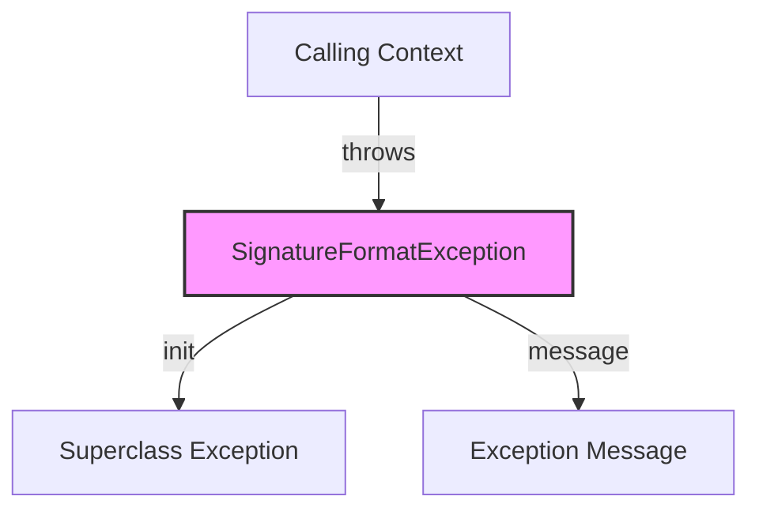

## Module: SignatureFormatException.java
基于您提供的代码模块，以下是用中文进行的全面分析：

- **模块名称**：SignatureFormatException
- **主要目标**：该模块的目的是定义一个特定的异常类型，用于处理与签名格式相关的错误情况。它继承自TronException，表明它是Tron项目中特定于异常处理的一部分。
- **关键功能**：
  - `SignatureFormatException()`：无参构造函数，创建一个不带消息的异常实例。
  - `SignatureFormatException(String message)`：带有详细错误信息的构造函数，允许在抛出异常时提供更多上下文。
- **关键变量**：没有显式的关键变量，因为这个类主要是通过其构造函数来传递错误信息的。
- **相互依赖性**：作为TronException的子类，它依赖于其父类的实现。此外，它可能被项目中处理签名操作的其他组件引用，以处理签名格式错误。
- **核心与辅助操作**：此模块主要包含核心操作，即异常的定义和初始化。没有明显的辅助操作。
- **操作序列**：在实际使用中，当检测到签名格式不正确时，会创建并抛出SignatureFormatException实例，可能会附带详细的错误信息。
- **性能方面**：作为一个异常类，其性能影响主要取决于异常被抛出的频率。频繁地抛出和捕获异常可能会对性能产生负面影响。
- **可重用性**：由于这是一个针对特定错误情况（即签名格式错误）的异常类，其可重用性主要限于处理类似错误的上下文中。
- **使用**：在Tron项目中，当签名验证或处理过程中遇到格式不正确的签名时，可以使用此异常来指示和处理这种特定类型的错误。
- **假设**：使用此异常类的前提假设是存在一个明确的签名格式要求，且该格式在整个系统中是已知和一致的。此外，还假设调用者能够适当地捕获并处理这种异常，以避免程序因未处理的异常而意外终止。

总的来说，SignatureFormatException模块是Tron项目中用于处理签名格式错误的异常类，它通过提供专门的构造函数来允许传递错误信息，是处理签名相关错误的重要组成部分。
## Flow Diagram [via mermaid]

