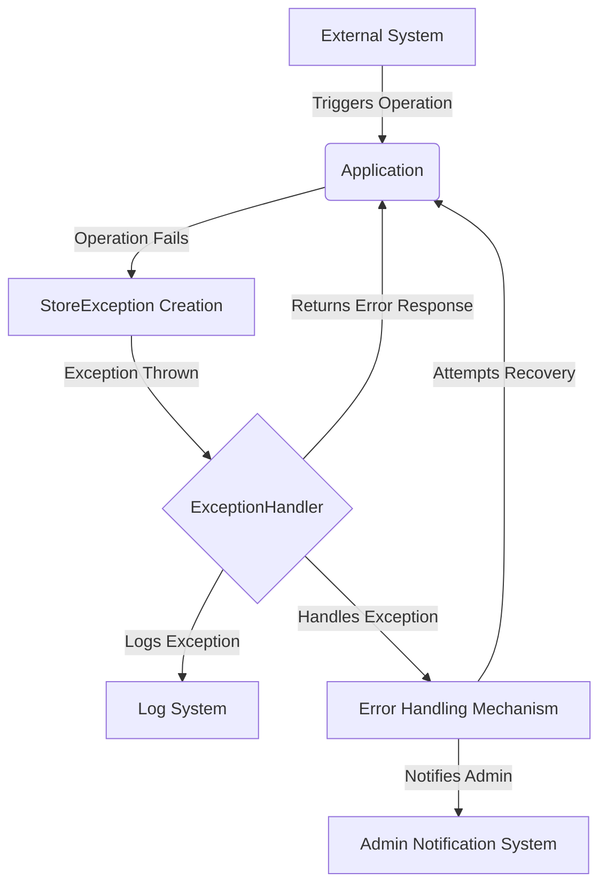

## Module: StoreException.java
- **模块名称**: StoreException.java

- **主要目标**: 此模块的目的是定义一个特定的异常类型——StoreException，用于处理与存储（可能是数据库或其他形式的数据存储）相关的异常情况。

- **关键功能**:
  - `StoreException()`: 无参数构造函数，创建一个没有详细错误信息的异常。
  - `StoreException(String message)`: 接受一个字符串参数的构造函数，创建一个包含详细错误信息的异常。
  - `StoreException(String message, Throwable cause)`: 接受一个错误信息和一个Throwable原因的构造函数，创建一个既包含详细错误信息又包含原始异常信息的异常。
  - `StoreException(Throwable cause)`: 接受一个Throwable原因的构造函数，创建一个包含原始异常信息但不包含详细错误信息的异常。

- **关键变量**: 由于StoreException类继承自Java的Exception类，其关键变量主要是继承自父类的，用于存储异常信息和原因的变量。

- **互依性**: StoreException类主要与系统中负责数据存储和处理的其他组件交互，当这些组件遇到无法处理的异常情况时，可能会抛出StoreException异常。

- **核心与辅助操作**: 本模块的核心操作是异常的构造和异常信息的传递，没有明确的辅助操作。

- **操作序列**: 作为一个异常类，StoreException的操作序列通常是在检测到异常情况时被创建和抛出，然后在更高层的异常处理逻辑中被捕获和处理。

- **性能方面**: 作为一个异常类，StoreException对性能的影响主要在于异常的创建和抛出操作，通常，频繁地抛出和处理异常可能会对性能产生负面影响，但这也取决于具体使用场景。

- **可重用性**: StoreException作为一个通用的存储异常类，具有较高的可重用性，可以在多个需要异常处理的存储操作中使用。

- **使用**: StoreException可以在任何存储操作失败时使用，例如数据库操作失败、文件访问失败等场景，通过抛出StoreException来通知调用者有异常发生。

- **假设**: 在设计StoreException时，假设调用者需要详细的错误信息或原始异常信息来进行适当的异常处理和日志记录。
## Flow Diagram [via mermaid]

