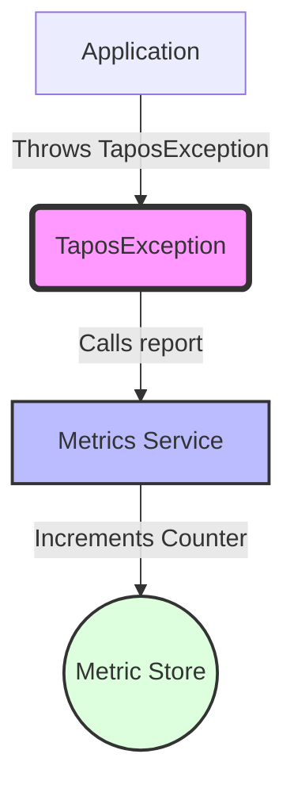

## Module: TaposException.java
**模块名称**：TaposException.java

**主要目的**：此模块定义了一个特定的异常类，即TaposException，它继承自TronException。这个异常类专门用于处理与TAPOS（Transaction as Proof of Stake）相关的异常情况。TAPOS是一种区块链技术，用于确保交易的正确性和安全性。

**关键功能**：
- `TaposException()`：一个无参构造函数，提供了一个基本的异常实例。
- `TaposException(String message)`：带有错误信息的构造函数，允许在抛出异常时提供更多上下文。
- `TaposException(String message, Throwable cause)`：允许同时传递错误信息和导致异常的原因，为异常处理提供更多的灵活性。
- `report()`：这是一个受保护的方法，用于在发生TAPOS异常时增加特定的指标计数，帮助监控和诊断问题。

**关键变量**：没有直接定义的关键变量，但通过调用`Metrics.counterInc`方法，间接与监控系统的指标（MetricKeys.Counter.TXS 和 MetricLabels.Counter.TXS_FAIL_TAPOS）相关联。

**交互依赖**：此类与系统的监控组件有显著的交互，尤其是通过使用`Metrics.counterInc`方法来报告TAPOS异常事件。

**核心与辅助操作**：核心操作包括异常的构造和通过`report`方法的异常事件报告。辅助操作可能包括与异常信息和原因相关的任何处理。

**操作顺序**：在发生TAPOS异常情况时，首先通过构造函数创建异常实例，然后可能调用`report`方法来报告此异常事件。

**性能方面**：性能考虑主要与如何高效地记录和报告异常相关。`report`方法的实现需要确保对性能的影响最小，特别是在高频异常事件发生时。

**可重用性**：TaposException作为一个专门的异常类，其可重用性主要在于能够为处理TAPOS相关的错误提供一致的接口和行为。

**使用**：在处理TAPOS逻辑时，如果遇到任何不符合预期的情况或错误，可以抛出TaposException异常。这有助于错误的捕获、处理和报告。

**假设**：此类的实现基于几个假设：
- 系统已经有一个成熟的监控机制，能够处理`Metrics.counterInc`方法的调用。
- TAPOS异常是值得单独识别和报告的，这表明TAPOS逻辑在系统中占有重要地位。
- 异常处理机制能够妥善处理通过构造函数传递的信息和原因。
## Flow Diagram [via mermaid]

