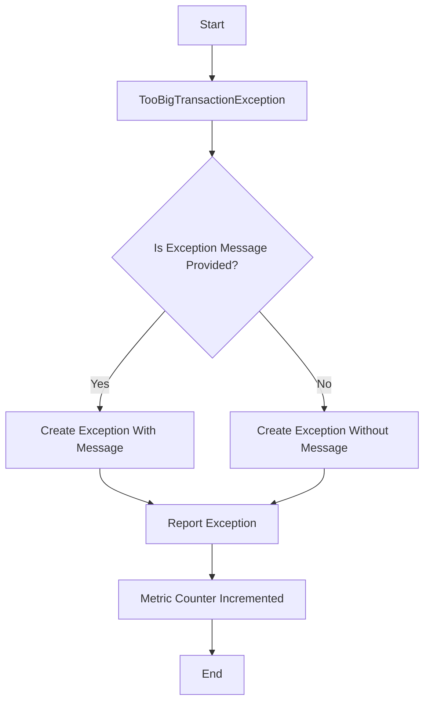

## Module: TooBigTransactionException.java
**模块名称**：TooBigTransactionException.java

**主要目标**：此模块的目的是定义一个特定的异常类，用于处理在Tron区块链平台上发生的交易过大的情况。这是一个自定义异常，继承自TronException，专门用于标识和处理交易大小超出预定限制的情况。

**关键函数**：
- `TooBigTransactionException()`：一个无参数构造函数，创建一个基本的异常实例。
- `TooBigTransactionException(String message)`：带有详细错误信息的构造函数，允许在抛出异常时提供更多上下文。
- `report()`：一个受保护的方法，用于在发生过大的交易异常时，通过Prometheus指标系统报告该事件。此方法增加了一个特定的计数器，用于监控过大的交易失败事件。

**关键变量**：无直接变量，但通过构造函数接收的`message`参数和`report`方法中使用的`MetricKeys`和`MetricLabels`与性能监控相关。

**相互依赖性**：此异常类与Tron区块链的异常处理系统、日志记录和Prometheus监控系统相互依赖。特别是，`report`方法依赖于`Metrics`类来记录事件。

**核心与辅助操作**：
- 核心操作：定义异常、抛出异常。
- 辅助操作：通过`report`方法记录监控事件，这有助于系统管理员监控和响应过大的交易失败事件。

**操作序列**：当系统检测到一个过大的交易时，将抛出此异常，并可能调用`report`方法来记录此事件，以便进行监控和后续处理。

**性能方面**：`report`方法的调用涉及到与监控系统的交互，虽然对性能的影响应该是最小的，但在高频率异常事件发生时，应考虑其对性能的潜在影响。

**可重用性**：作为一个专门的异常类，其可重用性主要局限于Tron区块链平台的上下文中，用于处理和报告特定的交易过大问题。

**使用**：此异常类应在交易处理流程中检测到交易大小超过允许的最大值时使用，用于抛出并可能记录异常事件。

**假设**：在设计此异常类时，假设了系统需要对交易大小进行限制，并且需要一种机制来监控和报告超出这些限制的事件。此外，假设系统已集成Prometheus监控。

这个分析提供了对TooBigTransactionException模块的全面了解，从其目的和关键功能到性能和可重用性等方面。
## Flow Diagram [via mermaid]

