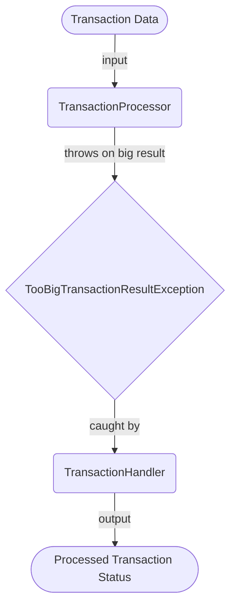

## Module: TooBigTransactionResultException.java
- **模块名称**：TooBigTransactionResultException.java
- **主要目标**：定义一个专门用于处理交易结果过大异常的类。此类的目的是在Tron区块链平台的交易处理过程中，当交易结果超出预定范围或大小时，提供一个明确的异常反馈。
- **关键功能**：
  - 构造函数（无参）：创建一个带有默认错误信息（"too big transaction result"）的异常实例。
  - 构造函数（带有String参数）：允许创建一个带有自定义错误信息的异常实例。
- **关键变量**：无直接关键变量，但错误信息（默认或自定义）是传递异常信息的关键。
- **相互依赖性**：作为Tron区块链平台的一部分，此异常类依赖于更广泛的异常处理框架（例如，继承自TronException）。它可能会与交易处理逻辑交互，特别是在交易结果验证阶段。
- **核心与辅助操作**：此类的核心操作是提供异常信息的传递。没有明显的辅助操作，因为类的主要目的是作为异常传递的载体。
- **操作序列**：在交易结果处理过程中，如果检测到结果过大，将抛出TooBigTransactionResultException异常，这通常会中断当前操作流程，并可能触发错误处理逻辑。
- **性能方面**：作为一个异常类，其性能影响主要在于异常创建和抛出的开销。在高性能环境中，频繁抛出异常可能会影响总体性能。
- **可重用性**：此异常类设计为特定于Tron区块链平台的交易结果过大问题，但其模式和实现可适用于需要类似异常处理的其他上下文。
- **使用**：在处理Tron区块链上的交易时，如果交易的结果因为太大而无法处理，将使用此异常类来通知调用者。
- **假设**：假设存在一个明确的界限或标准，定义了什么构成“太大”的交易结果。此外，假设调用者具有处理此类异常的能力，例如通过捕获异常并采取适当的错误处理措施。
## Flow Diagram [via mermaid]

