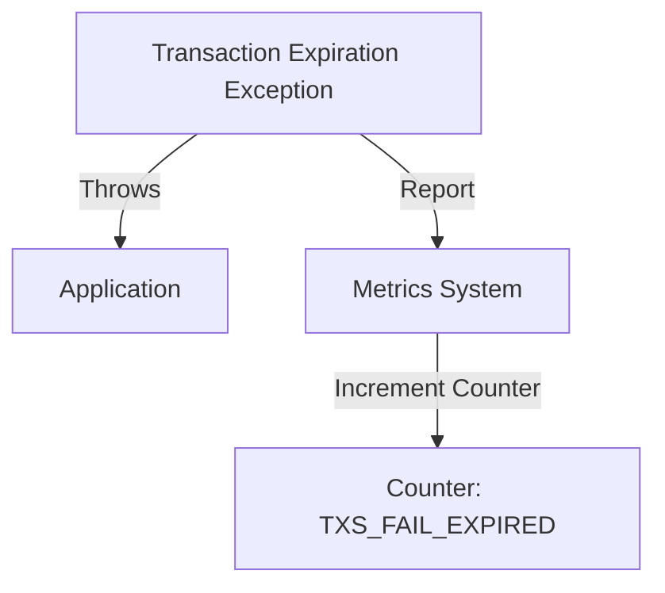

## Module: TransactionExpirationException.java
- **模块名称**: TransactionExpirationException.java

- **主要目标**: 此模块的目的是定义一个特定的异常类型——交易过期异常。这是在处理区块链交易时，当交易超出了其有效期限而未能被确认时抛出的异常。

- **关键函数**:
  - `TransactionExpirationException()`: 无参构造函数，创建一个基本的异常实例。
  - `TransactionExpirationException(String message)`: 带有消息参数的构造函数，允许在创建异常时附加自定义消息。
  - `report()`: 此方法用于报告交易过期异常的发生，通过增加特定的度量计数器来实现。

- **关键变量**: 无直接变量，但涉及到的关键是异常信息（`message`），以及与性能监控相关的度量标签（`MetricKeys`, `MetricLabels`）。

- **相互依赖性**: 该异常类依赖于`org.tron.common.prometheus`包中的`Metrics`类来报告异常事件。这表明它与系统的性能监控组件有交互。

- **核心与辅助操作**: 核心操作是异常的创建和异常信息的报告。辅助操作包括通过`report`方法增加度量计数器，这有助于监控和分析异常发生的频率。

- **操作序列**: 在检测到交易过期的情况下，首先创建`TransactionExpirationException`实例，随后可能调用`report`方法来记录此次异常事件。

- **性能方面**: 通过`report`方法中的度量计数器增加操作，此模块对性能监控提供了支持。这有助于识别和分析系统中交易过期的异常模式。

- **可重用性**: 作为一个特定的异常类，其可重用性主要体现在可以在需要处理交易过期异常的任何地方使用此异常类。同时，通过自定义异常信息，可以使得异常处理更加灵活。

- **使用方式**: 在处理交易时，如果检测到交易已经过期，则可以抛出`TransactionExpirationException`，并可选择调用`report`方法来记录此事件。

- **假设**: 此模块的设计假设是系统需要对交易过期事件进行特定的处理和监控。假设系统已经集成了`org.tron.common.prometheus`包中的性能监控工具。
## Flow Diagram [via mermaid]

