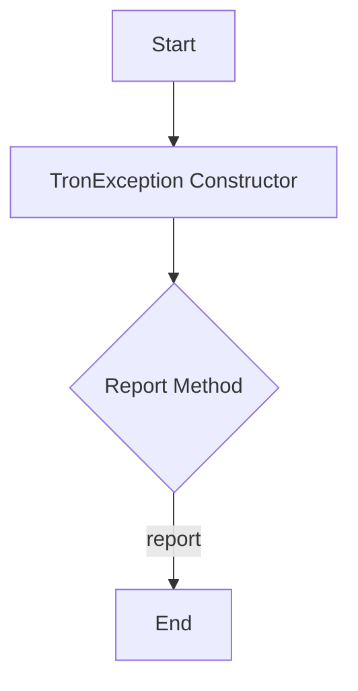

## Module: TronException.java
由于您提供的代码示例较为简单，我们将基于这段代码进行分析。

- **模块名称**：TronException.java

- **主要目标**：这个模块的目的是定义一个自定义异常类，用于处理特定于Tron项目的异常情况。

- **关键函数**：
  - `TronException()`：一个无参构造函数，创建一个基本的异常实例，并调用`report`方法。
  - `TronException(String message)`：带有一条错误信息的构造函数，创建一个包含详细信息的异常实例，并调用`report`方法。
  - `TronException(String message, Throwable cause)`：带有错误信息和导致异常的原因的构造函数，创建一个更详细的异常实例，并调用`report`方法。
  - `report()`：一个受保护的方法，目前的实现为空，预计用于报告或记录异常情况。

- **关键变量**：无直接变量，但构造函数使用的参数（`message`, `cause`）是关键信息的载体。

- **互依赖性**：此类扩展了Java的`Exception`类，依赖于Java标准异常处理机制。可能与系统的其他部分（如日志记录系统）有互动，尤其是如果`report`方法被实现用于异常报告。

- **核心与辅助操作**：
  - 核心操作：异常实例的创建和初始化。
  - 辅助操作：`report`方法，虽然当前为空，但预期用于辅助的异常报告或日志记录功能。

- **操作序列**：当出现特定于Tron项目的异常情况时，将创建`TronException`的实例，可能会通过`report`方法进行异常情况的报告或记录。

- **性能方面**：由于`report`方法当前为空，对性能的影响应该是最小的。但是，如果在`report`方法中添加了复杂的日志记录或错误处理逻辑，可能会对性能产生影响。

- **可重用性**：`TronException`类设计为可重用，可以在Tron项目中的多个地方捕获和处理特定的异常情况。

- **使用**：在Tron项目中，当需要处理特定的异常情况时，可以抛出`TronException`或其子类的实例。

- **假设**：该模块假设将来可能需要更复杂的异常报告机制，因此提供了一个受保护的`report`方法用于扩展。

以上是基于提供的代码对`TronException.java`模块的分析。请注意，由于`report`方法的实际实现未给出，对其功能的假设可能需要根据实际情况进行调整。
## Flow Diagram [via mermaid]

