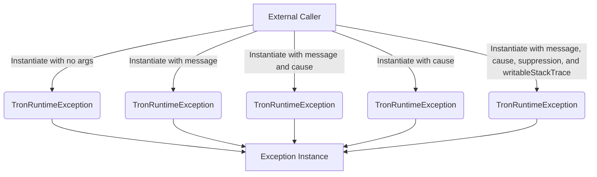

## Module: TronRuntimeException.java
- **模块名称**：TronRuntimeException.java

- **主要目标**：此模块的目的是定义一个特定于Tron项目的异常类，它扩展了Java的`RuntimeException`。这允许Tron项目在遇到运行时异常时抛出一个特定的异常，以便更好地控制错误处理流程。

- **关键功能**：
  - `TronRuntimeException()`：无参构造函数，创建一个没有详细消息的异常。
  - `TronRuntimeException(String message)`：带有详细消息的构造函数。
  - `TronRuntimeException(String message, Throwable cause)`：带有详细消息和导致异常发生的原因的构造函数。
  - `TronRuntimeException(Throwable cause)`：仅带有导致异常发生的原因的构造函数。
  - `TronRuntimeException(String message, Throwable cause, boolean enableSuppression, boolean writableStackTrace)`：允许启用或禁用抑制和堆栈跟踪可写性的高级构造函数。

- **关键变量**：由于这是一个异常类，主要的“变量”实际上是构造函数中的参数，如`message`和`cause`。

- **依赖性**：此类依赖于Java标准的`RuntimeException`类，继承了其所有功能。

- **核心与辅助操作**：在这个类中，所有的构造函数都是核心操作，因为它们定义了异常对象的创建方式。没有明确的辅助操作。

- **操作顺序**：通常，此异常类的实例将在Tron项目的代码执行中遇到错误时被创建和抛出。操作顺序由异常处理机制决定。

- **性能方面**：作为一个异常类，性能考虑不是主要焦点，但是合理使用异常（例如，避免在正常控制流中过度使用异常）可以帮助保持良好的性能。

- **可重用性**：由于这是一个特定于项目的异常类，其直接的可重用性可能有限。然而，作为一个扩展了`RuntimeException`的类，它展示了如何创建自定义异常，这种模式可以在其他项目中重用。

- **使用**：在Tron项目中，当遇到无法恢复的运行时错误时，可以抛出`TronRuntimeException`实例。这使得错误处理更加统一和可控。

- **假设**：创建此异常类的假设是，Tron项目需要一种方法来区分普通的运行时异常和特定于项目的异常情况。这有助于更好地控制和处理异常情况。
## Flow Diagram [via mermaid]

