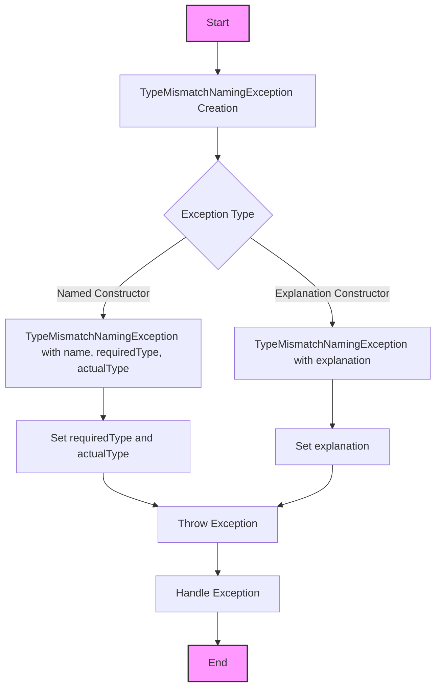

## Module: TypeMismatchNamingException.java
- **模块名称**：TypeMismatchNamingException.java

- **主要目标**：此模块的目的是定义一个特定的异常，用于处理类型不匹配的情况。当尝试将某个对象分配给不兼容类型的变量时，就会抛出这个异常。

- **关键函数**：
  - `TypeMismatchNamingException(String name, Class<?> requiredType, Class<?> actualType)`：构造函数，用于创建异常实例，并描述期望类型和实际类型不匹配的详细信息。
  - `TypeMismatchNamingException(String explanation)`：另一个构造函数，允许直接传入异常说明。
  - `getRequiredType()`：返回期望的类型。
  - `getActualType()`：返回实际的类型。

- **关键变量**：
  - `requiredType`：期望的类型。
  - `actualType`：实际的类型。

- **互相依赖**：此异常类是独立的，但它设计用于在类型不匹配时由系统的其他部分抛出，表明它与系统中处理类型分配逻辑的部分有互动。

- **核心与辅助操作**：在此模块中，构造异常对象并提供关于类型不匹配的详细信息是核心操作。获取期望类型和实际类型的方法可以视为辅助操作，帮助进一步理解异常情况。

- **操作序列**：通常，当系统尝试将对象分配给不兼容的类型时，会首先检测到类型不匹配，然后创建并抛出`TypeMismatchNamingException`实例，最后，可能通过捕获此异常来处理错误情况。

- **性能方面**：此异常类本身对性能的影响较小，但频繁地抛出和捕获异常可能会对性能产生负面影响，特别是在关键路径上。

- **可重用性**：这个异常类设计得相对通用，可以在需要处理类型不匹配问题的任何地方重用。

- **使用**：在类型不匹配时抛出此异常，例如，当从一个存储位置检索对象并尝试将其分配给不兼容类型的变量时。

- **假设**：此类假设类型不匹配是一个值得注意并需要明确处理的问题，这在类型安全的环境中尤其重要。
## Flow Diagram [via mermaid]

