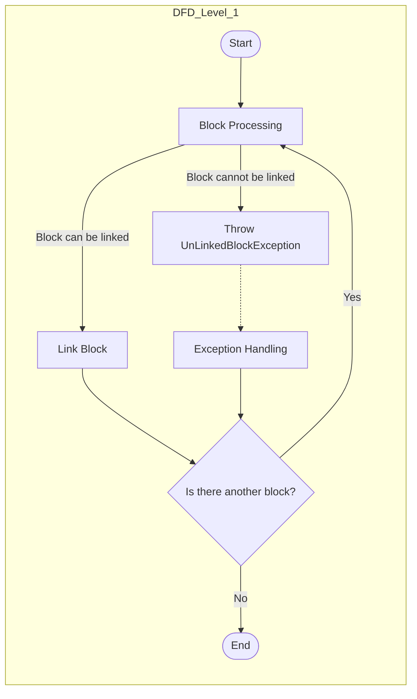

## Module: UnLinkedBlockException.java
**模块名称**：UnLinkedBlockException.java

**主要目标**：该模块的目的是定义一个特定的异常类，用于处理在区块链操作中遇到的未链接区块的异常情况。这是在区块链技术中，特别是在Tron区块链框架内，处理异常流程的一部分。

**关键功能**：
- `UnLinkedBlockException()`：一个无参数的构造函数，用于创建异常实例时不提供任何消息。
- `UnLinkedBlockException(String message)`：带有一个字符串参数的构造函数，允许在创建异常实例时提供描述性消息。
- `UnLinkedBlockException(String message, Throwable cause)`：一个带有两个参数的构造函数，允许在创建异常实例时提供描述性消息和一个可抛出的原因，用于链式异常处理。

**关键变量**：没有特定的变量，因为这是一个异常类，主要通过构造函数传递信息。

**相互依赖性**：作为Tron区块链框架的一部分，这个异常类可能与处理区块链操作的其他组件相互作用，尤其是在区块链接或验证过程中。

**核心与辅助操作**：该模块的核心操作是提供一种机制来创建和抛出未链接区块的异常。没有明确的辅助操作，因为它主要关注于异常的定义和传递。

**操作序列**：在正常使用中，当系统检测到一个未链接的区块时，会实例化并抛出UnLinkedBlockException，可能包含错误信息和/或原因。

**性能方面**：作为一个异常类，性能考虑不是主要焦点。然而，异常处理应该高效，避免不必要的资源消耗。

**可重用性**：这个异常类具有高度的可重用性，因为它可以在Tron区块链框架的任何地方被抛出，前提是遇到未链接区块的情况。

**使用**：在Tron区块链框架的任何组件中，当检测到一个区块没有正确链接到区块链时，可以使用这个异常类来标识和报告这个问题。

**假设**：使用这个异常类的主要假设是系统能够检测到未链接的区块，并且需要通过异常机制来通知或处理这种情况。

通过这个分析，我们可以看出UnLinkedBlockException是Tron区块链框架中用于处理特定异常情况的一个工具，它通过提供标准的异常处理机制来增强代码的健壮性和可维护性。
## Flow Diagram [via mermaid]

