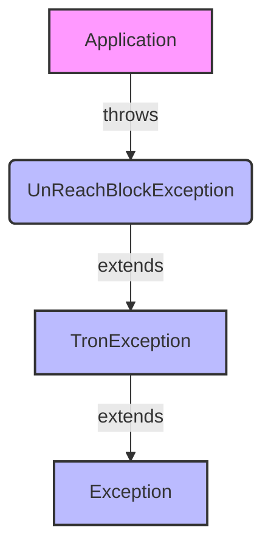

## Module: UnReachBlockException.java
- **模块名称**：UnReachBlockException.java

- **主要目标**：此模块的目的是定义一个特定的异常类型——UnReachBlockException，用于处理在Tron区块链框架中达不到特定区块时抛出的异常情况。

- **关键功能**：
  - `UnReachBlockException()`：一个无参构造方法，创建一个基本的异常实例。
  - `UnReachBlockException(String message)`：带有详细错误信息的构造方法，用于提供关于异常的更多上下文。
  - `UnReachBlockException(String message, Throwable cause)`：带有错误信息和导致异常的原因（另一个异常）的构造方法，用于异常链的构建。

- **关键变量**：由于这是一个异常类，其关键变量主要是继承自`TronException`的异常消息（message）和原因（cause）。

- **相互依赖性**：此异常类继承自`TronException`，表明它是Tron区块链框架特定异常体系的一部分。它可能与处理区块链操作的其他组件相互作用，尤其是在区块访问或验证失败时。

- **核心 vs. 辅助操作**：核心操作包括异常的构建和初始化。辅助操作可能涉及到异常信息的获取和异常链的处理。

- **操作序列**：通常，当达不到特定区块的条件触发时，将抛出`UnReachBlockException`，这可能是在区块链操作的执行流程中的任何点。

- **性能方面**：作为一个异常类，它的性能影响相对较小，但是异常的创建和抛出在高性能环境中应当谨慎使用，以避免不必要的性能开销。

- **可重用性**：此异常类设计为可重用，可在Tron区块链框架的任何部分，需要指示无法达到区块的情况时使用。

- **使用**：在Tron区块链框架内，当操作无法成功达到预期的区块时，可以使用此异常类来标识和处理这种特殊情况。

- **假设**：在设计此异常类时，假设了用户或开发者需要明确区分区块访问失败的情况，以便于更好地诊断和处理问题。
## Flow Diagram [via mermaid]

