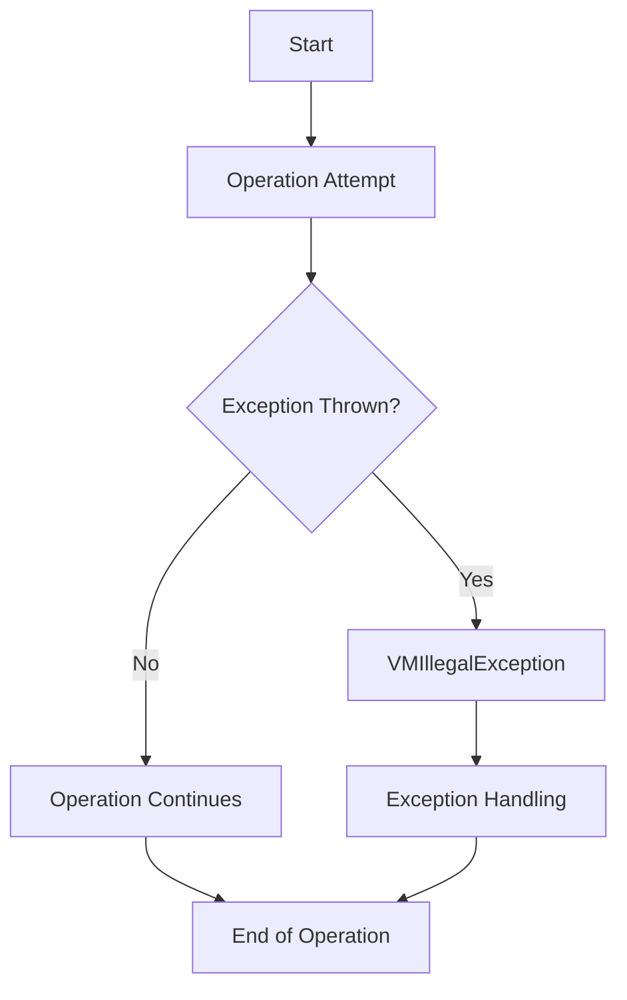

## Module: VMIllegalException.java
- **模块名称**：VMIllegalException.java

- **主要目标**：此模块的目的是定义一个特定的异常类型——VMIllegalException，用于处理与虚拟机（VM）相关的非法操作或异常情况。

- **关键函数**：
  - `VMIllegalException()`：无参构造函数，创建一个不带消息的异常实例。
  - `VMIllegalException(String message)`：带有详细信息的构造函数，允许在创建异常实例时附加具体的错误消息。

- **关键变量**：此模块中没有显式的关键变量，但错误消息（`String message`）可以视为传递给异常的关键信息。

- **相互依赖性**：VMIllegalException继承自TronException，表明它是Tron项目异常体系的一部分。这意味着它与Tron项目中处理异常的其他组件有关联。

- **核心与辅助操作**：核心操作包括通过构造函数创建异常实例。没有明显的辅助操作，因为此模块专注于定义异常类型。

- **操作序列**：在遇到虚拟机操作中的非法情况时，可以创建并抛出VMIllegalException实例。操作序列依赖于外部代码如何使用此异常类。

- **性能方面**：作为异常类，VMIllegalException的性能考虑主要涉及到异常创建和抛出的开销。在Java中，异常处理通常与直接的条件检查相比有更高的开销，但这是可接受的，因为异常情况不应频繁发生。

- **可重用性**：VMIllegalException作为特定于Tron项目的异常类，其可重用性主要限于该项目或需要处理类似虚拟机非法操作的其他项目。

- **使用**：当Tron项目中的虚拟机操作遇到非法状态或不合法的指令时，可以使用VMIllegalException来标识和报告这些问题。

- **假设**：开发此模块的一个假设是，区分和处理虚拟机中的非法操作是必要的。这表明Tron项目预期会遇到需要通过抛出异常来处理的特定错误或非法状态。
## Flow Diagram [via mermaid]

