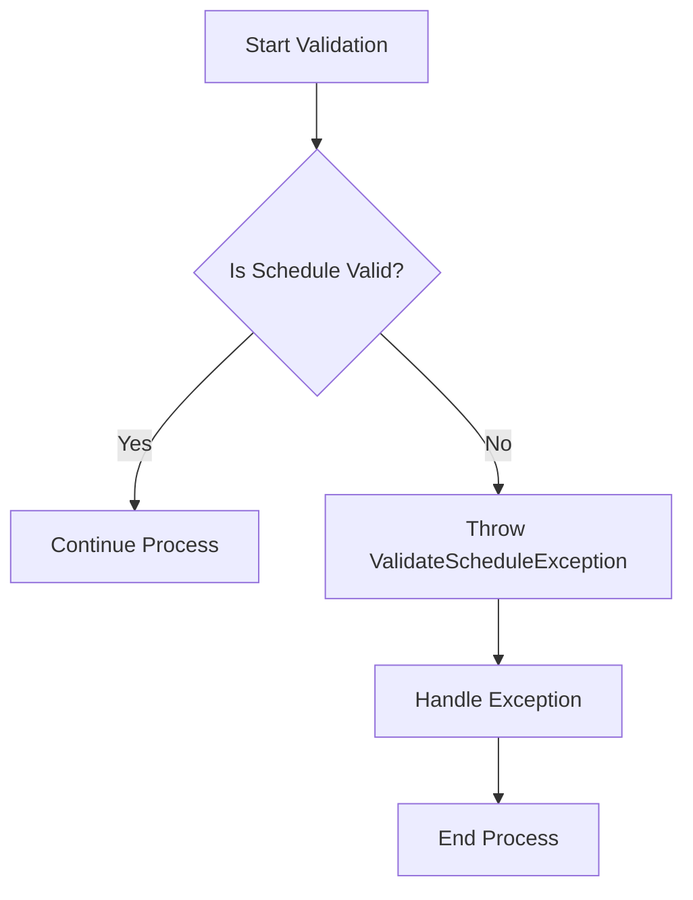

## Module: ValidateScheduleException.java
- **模块名称**：ValidateScheduleException.java

- **主要目的**：该模块的目的是定义一个特定的异常类，用于处理与Tron区块链中的调度验证相关的异常情况。这使得错误处理更加具体化和清晰化。

- **关键函数**：
  - `ValidateScheduleException()`：一个无参数的构造函数，创建一个基本的异常实例。
  - `ValidateScheduleException(String message)`：带有详细错误信息的构造函数，允许在抛出异常时提供更多上下文。

- **关键变量**：没有明显的关键变量，因为这个类主要是通过其构造函数来传递异常信息的。

- **相互依赖性**：作为`TronException`的子类，该模块依赖于更广泛的Tron区块链异常处理框架。它与系统中处理异常的其他部分相互作用。

- **核心与辅助操作**：本模块主要关注核心操作，即异常的定义和传递。没有明显的辅助操作。

- **操作序列**：在遇到调度验证错误时，此异常被创建并抛出，以便上层逻辑可以捕获并相应处理。

- **性能方面**：作为一个异常类，其性能影响主要取决于异常被抛出和处理的频率。在设计良好的系统中，异常应该是罕见的，因此不应该显著影响总体性能。

- **可重用性**：该异常类具有特定的用途，但是由于其继承自`TronException`，它可以在需要处理Tron区块链调度验证问题的任何地方重用。

- **使用**：当Tron区块链的调度验证过程中遇到不符合预期的情况时，可以使用此异常类来标识和报告错误。

- **假设**：使用此异常类的假设包括认为在Tron区块链的操作中，特定类型的调度验证错误是可以预见并需要特别处理的。此外，还假设调用者具有处理或传播此类异常的机制。
## Flow Diagram [via mermaid]

