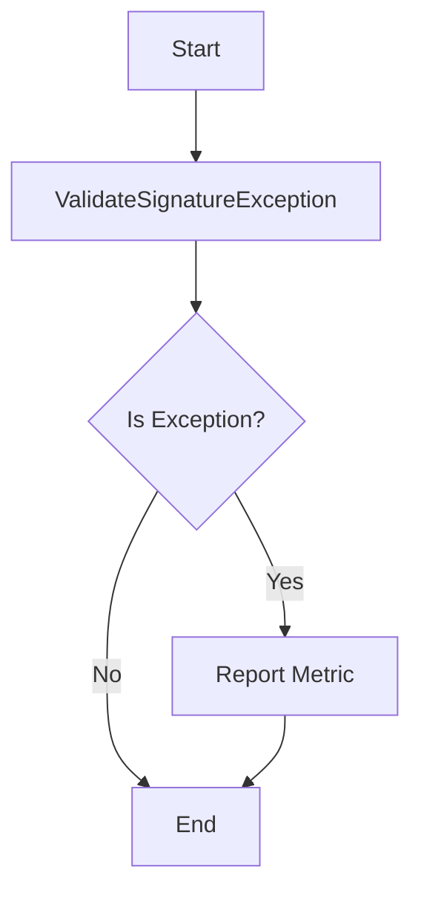

## Module: ValidateSignatureException.java
- **模块名称**: ValidateSignatureException.java

- **主要目标**: 该模块的目的是定义一个特定的异常，这个异常在波场(Tron)区块链框架中用于处理验证签名过程中发生的错误。

- **关键函数**:
  - `ValidateSignatureException()`: 构造函数，用于创建一个无特定错误信息的异常实例。
  - `ValidateSignatureException(String message)`: 带有错误信息的构造函数，允许在创建异常实例时附加具体的错误描述。
  - `report()`: 一个受保护的方法，用于在发生签名验证失败时，通过增加相应的计数器来报告错误。

- **关键变量**: 无直接的关键变量，但异常信息(`String message`)可以被视为传递错误详情的关键数据。

- **互依赖性**: 此类依赖于`org.tron.common.prometheus.Metrics`进行错误报告，以及`MetricKeys`和`MetricLabels`用于指定报告指标的键和标签。

- **核心与辅助操作**:
  - 核心操作: 抛出并处理签名验证异常。
  - 辅助操作: 通过`report`方法报告异常，这有助于监控和分析签名验证失败的情况。

- **操作序列**: 当签名验证失败时，首先通过构造函数创建`ValidateSignatureException`实例，然后可能调用`report`方法来报告此错误。

- **性能方面**: 该模块的性能考虑主要集中在异常处理和错误报告上。使用`Metrics.counterInc`进行错误计数可能会对性能产生轻微影响，但这对于监控和诊断问题是必要的。

- **可重用性**: 该异常类是专门为波场(Tron)框架设计的，但其模式和实现可以在需要处理类似签名验证异常的其他项目中重用或作为参考。

- **使用方式**: 在波场(Tron)区块链框架的签名验证过程中，如果验证失败，将抛出`ValidateSignatureException`异常。这有助于错误的捕获和处理，以及通过`report`方法进行错误监控。

- **假设**:
  - 假设存在一个有效的监控系统，能够处理和记录通过`report`方法报告的错误信息。
  - 假设使用此异常类的环境能够正确处理Java异常。
## Flow Diagram [via mermaid]

