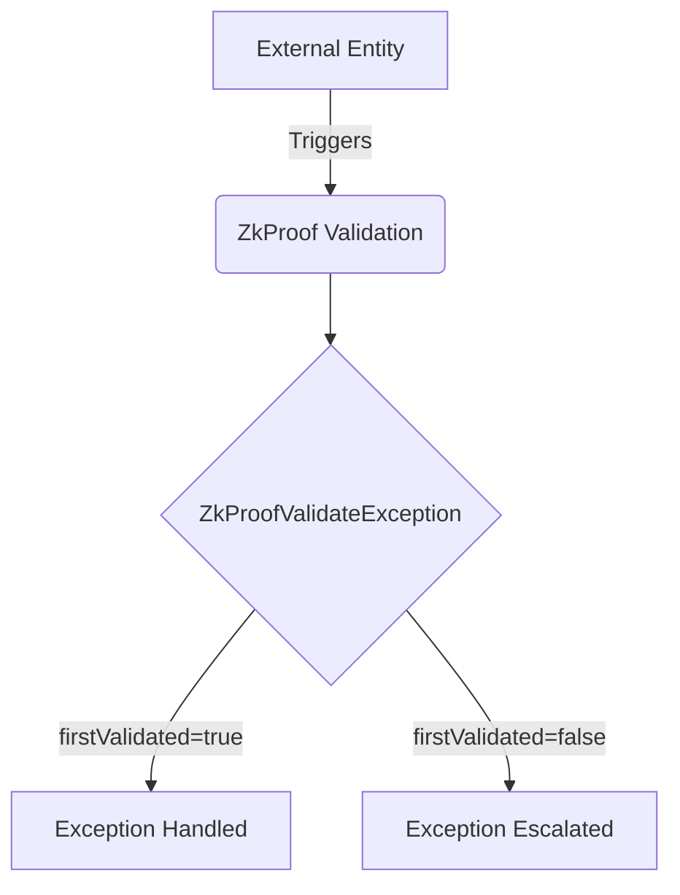

## Module: ZkProofValidateException.java
- **模块名称**: ZkProofValidateException.java

- **主要目标**: 该模块的目的是定义一个特定的异常，用于处理零知识证明验证过程中的错误或异常情况。

- **关键函数**:
  - `ZkProofValidateException(String message, boolean firstValidated)`: 构造函数，用于创建异常实例时传递错误信息和验证状态。

- **关键变量**:
  - `firstValidated`: 一个布尔类型的变量，用于标识在抛出异常前是否已经完成了第一次验证。

- **交互依赖**:
  - 作为`ContractValidateException`的子类，`ZkProofValidateException`继承了父类的方法和属性，可能与系统中负责合约验证的其他组件有交互。

- **核心 vs. 辅助操作**:
  - 核心操作是通过构造函数传递异常信息和验证状态。
  - 该模块没有明显的辅助操作。

- **操作序列**:
  - 当零知识证明验证失败或遇到不符合预期的情况时，将通过构造函数创建`ZkProofValidateException`实例，并可能被捕获和处理。

- **性能考虑**:
  - 作为异常处理机制的一部分，性能考虑可能不是主要焦点。但是，频繁地抛出和处理异常可能会影响应用程序的性能。

- **可重用性**:
  - 由于这是一个特定场景下的异常类，其可重用性可能受限于需要处理零知识证明验证异常的应用程序或模块。

- **使用方式**:
  - 当零知识证明的验证过程失败或不满足特定条件时，可以抛出`ZkProofValidateException`，并提供相关的错误信息和验证状态。

- **假设**:
  - 假设在抛出此异常之前，已经至少进行了一次验证尝试，这反映在`firstValidated`变量的状态中。
## Flow Diagram [via mermaid]

