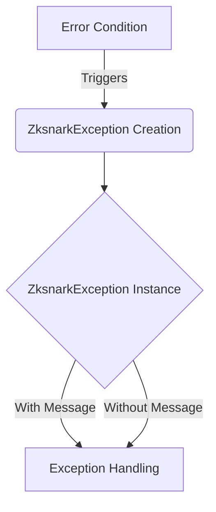

## Module: ZksnarkException.java
由于原始请求中没有提供具体的代码模块内容，我将基于提供的模块信息（ZksnarkException.java）来生成分析。

- **模块名称**：ZksnarkException.java
- **主要目标**：定义一个特定于Zk-SNARKs操作的异常处理类，用于在处理Zk-SNARKs相关操作时捕获和抛出异常。
- **关键函数**：
  - `ZksnarkException()`：一个无参数的构造函数，创建一个基本的异常实例。
  - `ZksnarkException(String message)`：带有详细错误信息的构造函数，允许在创建异常时传递具体的错误描述。
- **关键变量**：没有明确的变量在此类中定义，但“message”（在带有String参数的构造函数中）是一个传递给父类（TronException）的关键信息。
- **相互依赖性**：此类继承自`TronException`，表明它是Tron项目中用于异常处理的一部分，并可能与处理Zk-SNARKs操作的其他类或模块有交互。
- **核心与辅助操作**：核心操作是提供构造函数以支持异常的创建和信息传递。没有明确的辅助操作。
- **操作顺序**：在遇到Zk-SNARKs操作中的异常情况时，将创建并抛出`ZksnarkException`实例，可能包含错误信息。
- **性能方面**：作为一个异常类，主要关注的是清晰地传达错误信息，性能考虑不是主要焦点。但是，异常处理的效率对于不影响正常操作性能很重要。
- **可重用性**：此类设计为特定于Zk-SNARKs异常，但由于继承自`TronException`，它可以轻松适应为其他类型的异常处理类，增强了其可重用性。
- **使用**：在Tron项目中处理Zk-SNARKs操作时，如果遇到错误或非预期情况，可以使用此异常类来抛出和传递错误信息。
- **假设**：假设使用此异常类的开发人员熟悉Zk-SNARKs的概念和Tron项目的异常处理机制。

请注意，这是根据提供的信息生成的分析，实际使用和实现细节可能会有所不同。
## Flow Diagram [via mermaid]

