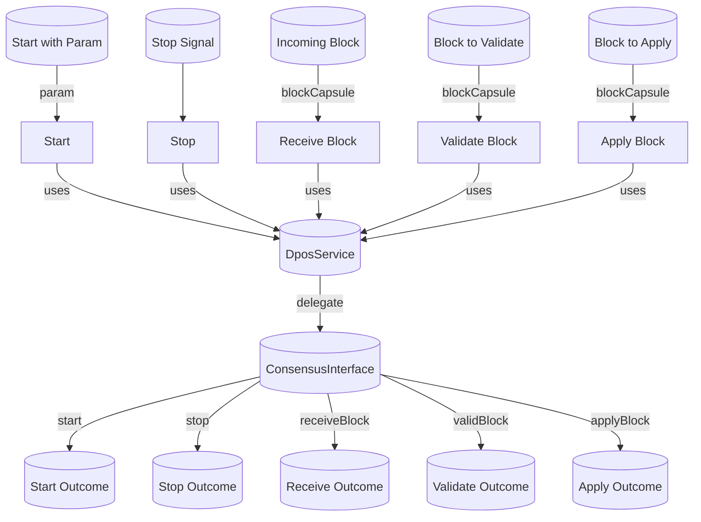

## Module: Consensus.java
模块名称：Consensus.java

**主要目标**：这个模块的目的是为了实现区块链的共识机制。它负责启动、停止共识过程，处理接收到的区块，验证和应用这些区块。

**关键功能**：
- `start(Param param)`: 启动共识过程，初始化共识接口为DposService。
- `stop()`: 停止共识过程。
- `receiveBlock(BlockCapsule blockCapsule)`: 接收区块并进行处理。
- `validBlock(BlockCapsule blockCapsule)`: 验证接收到的区块是否有效。
- `applyBlock(BlockCapsule blockCapsule)`: 应用（执行）接收到的区块。

**关键变量**：
- `DposService dposService`: 依赖注入的DposService服务，用于具体实现共识机制。
- `ConsensusInterface consensusInterface`: 一个共识接口，用于抽象化不同共识机制的实现。

**交互依赖**：该模块与`DposService`服务紧密相关，依赖于其实现共识机制的具体逻辑。

**核心与辅助操作**：启动和停止共识过程是核心操作，而验证和应用区块是辅助操作，这些操作确保了区块链的完整性和安全性。

**操作序列**：首先通过`start()`方法初始化共识机制，然后通过`receiveBlock()`接收区块，使用`validBlock()`验证区块的有效性，最后通过`applyBlock()`应用该区块。

**性能方面**：在共识过程中，区块的验证和应用是性能的关键考虑因素，因为它们直接影响到区块链的吞吐量和延迟。

**可重用性**：通过抽象接口`ConsensusInterface`，该模块的设计允许在不同的共识机制之间进行切换，提高了代码的可重用性。

**使用**：这个模块被用于区块链系统中，以实现和管理共识过程，确保区块链的数据一致性和安全性。

**假设**：在设计该模块时，做出的假设包括系统已经有一个可靠的`DposService`实现，以及系统能够有效地处理和存储接收到的区块。
## Flow Diagram [via mermaid]

