## Module: ConsensusDelegate.java
- **模块名称**: ConsensusDelegate.java

- **主要目标**: 该模块的目的是处理与共识机制相关的各种操作，包括但不限于维护见证人(witness)信息、投票数据、动态属性的更新等。

- **关键功能**:
  - `calculateFilledSlotsCount()`: 计算已填充的时隙数量。
  - `saveRemoveThePowerOfTheGr(long rate)`: 保存“移除权力”的比率。
  - `getRemoveThePowerOfTheGr()`: 获取“移除权力”的比率。
  - `getWitnessStandbyAllowance()`: 获取见证人待机津贴。
  - `getLatestBlockHeaderTimestamp()`: 获取最新区块头的时间戳。
  - `getLatestBlockHeaderNumber()`: 获取最新区块头的编号。
  - `lastHeadBlockIsMaintenance()`: 判断最后一个头块是否处于维护状态。
  - `saveActiveWitnesses(List<ByteString> addresses)`: 保存活跃见证人的地址。
  - `getActiveWitnesses()`: 获取活跃见证人的地址。
  - `saveAccount(AccountCapsule accountCapsule)`: 保存账户信息。
  - `getAccount(byte[] address)`: 根据地址获取账户信息。
  - `saveWitness(WitnessCapsule witnessCapsule)`: 保存见证人信息。
  - `getAllWitnesses()`: 获取所有见证人的信息。
  - `updateNextMaintenanceTime(long time)`: 更新下一次维护的时间。

- **关键变量**:
  - `dynamicPropertiesStore`: 动态属性存储，用于管理区块链的动态配置。
  - `delegationStore`: 代理存储，管理代理信息。
  - `accountStore`: 账户存储，管理账户信息。
  - `witnessStore`: 见证人存储，管理见证人信息。
  - `witnessScheduleStore`: 见证人日程存储，管理见证人的激活状态。
  - `votesStore`: 投票存储，管理投票信息。

- **相互依赖性**: 该模块与系统中的其他组件（如账户、见证人、投票等存储组件）紧密相连，共同支撑着区块链网络的共识机制。

- **核心与辅助操作**: 核心操作包括管理见证人信息、投票数据、动态属性的更新等。辅助操作包括维护账户信息、更新维护时间等。

- **操作序列**: 通常，操作序列遵循从接收区块或交易数据开始，到更新动态属性、处理见证人变更、维护投票信息等一系列步骤。

- **性能方面**: 在处理大量数据时，性能考虑包括数据库访问效率、数据结构的优化、内存管理等。

- **可重用性**: 该模块设计有良好的接口和分离的逻辑，使其在不同的上下文中具有较高的可重用性，特别是在需要共识机制处理的场景中。

- **使用**: 主要被区块链网络中负责共识处理的部分调用，以确保网络的正常运行和数据的一致性。

- **假设**: 假设所有输入数据都是有效的，且系统的其他部分（如数据库、网络等）正常运行。
## Flow Diagram [via mermaid]

```mermaid
flowchart TB
    ConsensusDelegate -->|uses| DynamicPropertiesStore
    ConsensusDelegate -->|uses| DelegationStore
    ConsensusDelegate -->|uses| AccountStore
    ConsensusDelegate -->|uses| WitnessStore
    ConsensusDelegate -->|uses| WitnessScheduleStore
    ConsensusDelegate -->|uses| VotesStore

    DynamicPropertiesStore -->|calculateFilledSlotsCount| ConsensusDelegate
    DynamicPropertiesStore -->|saveRemoveThePowerOfTheGr| ConsensusDelegate
    DynamicPropertiesStore -->|getRemoveThePowerOfTheGr| ConsensusDelegate
    DynamicPropertiesStore -->|getWitnessStandbyAllowance| ConsensusDelegate
    DynamicPropertiesStore -->|getLatestBlockHeaderTimestamp| ConsensusDelegate
    DynamicPropertiesStore -->|getLatestBlockHeaderNumber| ConsensusDelegate
    DynamicPropertiesStore -->|getStateFlag| ConsensusDelegate
    DynamicPropertiesStore -->|getMaintenanceSkipSlots| ConsensusDelegate
    DynamicPropertiesStore -->|saveStateFlag| ConsensusDelegate
    DynamicPropertiesStore -->|updateNextMaintenanceTime| ConsensusDelegate
    DynamicPropertiesStore -->|getNextMaintenanceTime| ConsensusDelegate
    DynamicPropertiesStore -->|getLatestSolidifiedBlockNum| ConsensusDelegate
    DynamicPropertiesStore -->|saveLatestSolidifiedBlockNum| ConsensusDelegate
    DynamicPropertiesStore -->|applyBlock| ConsensusDelegate
    DynamicPropertiesStore -->|allowChangeDelegation| ConsensusDelegate

    WitnessScheduleStore -->|saveActiveWitnesses| ConsensusDelegate
    WitnessScheduleStore -->|getActiveWitnesses| ConsensusDelegate

    AccountStore -->|getAccount| ConsensusDelegate
    AccountStore -->|saveAccount| ConsensusDelegate

    WitnessStore -->|getWitness| ConsensusDelegate
    WitnessStore -->|saveWitness| ConsensusDelegate
    WitnessStore -->|getAllWitnesses| ConsensusDelegate
```

