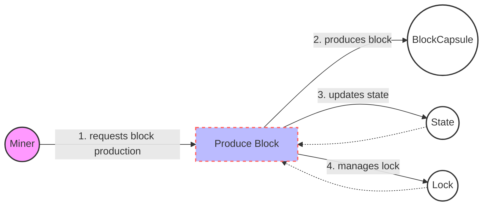

## Module: BlockHandle.java
由于原始请求中没有提供具体的代码实现细节，以下分析基于提供的模块接口描述进行。

- **模块名称**：BlockHandle.java

- **主要目标**：该模块的目的是定义一个处理区块生产和状态管理的接口，它为区块链系统中的区块生产和管理提供了一个标准化的方法。

- **关键函数**：
  - `getState()`：获取当前的状态。
  - `getLock()`：获取操作的锁对象，用于同步控制。
  - `produce(Miner miner, long blockTime, long timeout)`：根据矿工信息、区块时间和超时设置，生产一个新的区块。
  - `setBlockWaitLock(boolean flag)`：设置区块等待锁的状态。

- **关键变量**：由于这是一个接口，直接的变量定义不在此处，但关键的概念包括矿工（Miner）、区块时间（blockTime）、超时（timeout）等，这些都是在`produce`方法中使用的参数。

- **互依赖性**：此接口可能依赖于其他系统组件，如区块链的状态管理（State）、区块封装（BlockCapsule）以及可能的同步机制（如通过`getLock`方法暴露的锁）。同时，实现此接口的类可能需要与矿工管理、区块链的存储和网络传输等其他系统组件交互。

- **核心 vs. 辅助操作**：`produce`方法是核心操作，负责新区块的生产。其他方法如`getState`、`getLock`和`setBlockWaitLock`则可以视为辅助操作，支持区块生产的同步和状态管理。

- **操作顺序**：在一个典型的场景中，可能首先通过`getLock`获取同步锁，然后`setBlockWaitLock`设置等待锁状态，之后`produce`方法被调用以生产新的区块，最后通过`getState`获取当前状态。

- **性能方面**：性能考虑可能包括`produce`方法的效率，特别是在高并发环境下的同步控制（通过`getLock`），以及状态管理的效率。

- **可重用性**：作为一个接口，BlockHandle旨在提供一组标准化操作，以便不同的实现可以根据具体的区块链系统需求来生产区块。这种设计促进了代码的可重用性和模块化。

- **使用**：实现此接口的类将被用于区块链系统中，负责具体的区块生产逻辑和状态管理。它的使用依赖于具体的实现类如何被集成和调用。

- **假设**：此接口的设计基于几个假设，包括存在一个可以同步访问和修改的系统状态，区块的生产可以根据提供的矿工信息和时间参数进行，以及系统能够处理同步和状态管理所需的锁机制。

请注意，以上分析基于接口的描述，实际的实现细节可能会有所不同。
## Flow Diagram [via mermaid]

