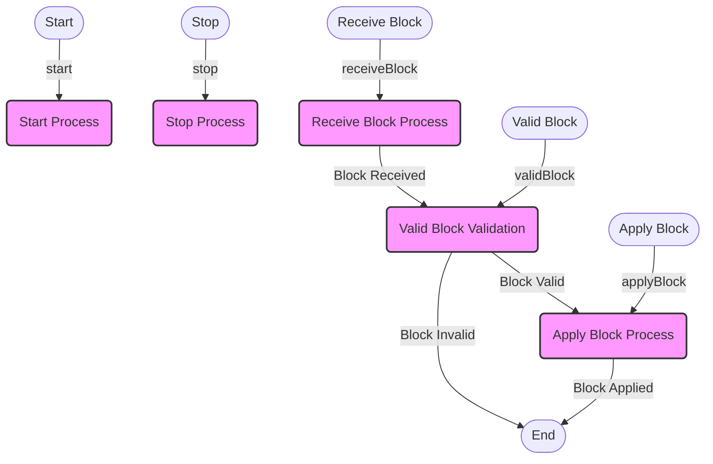

## Module: ConsensusInterface.java
- **模块名称**：ConsensusInterface.java

- **主要目标**：该模块的目的是定义了一个共识机制接口，用于区块链系统中实现不同的共识算法。它旨在为区块链网络中的区块验证、接收、应用提供一个标准化的操作流程。

- **关键功能**：
  - `start(Param param)`：启动共识机制，接受初始化参数。
  - `stop()`：停止共识机制。
  - `receiveBlock(BlockCapsule block)`：接收一个区块，准备进行验证和应用。
  - `validBlock(BlockCapsule block)`：验证一个区块的有效性。
  - `applyBlock(BlockCapsule block)`：应用一个区块到区块链上。

- **关键变量**：由于这是一个接口，主要定义了方法而没有直接的变量。但关键的概念是`BlockCapsule`，这是一个封装了区块信息的类。

- **相互依赖性**：此接口依赖于`BlockCapsule`类，这表明它与系统中负责区块处理的其他组件有紧密的联系。

- **核心与辅助操作**：核心操作包括区块的接收(`receiveBlock`)、验证(`validBlock`)和应用(`applyBlock`)。而`start`和`stop`方法可以视为辅助操作，用于管理共识机制的生命周期。

- **操作序列**：通常的流程是首先通过`start`方法启动共识机制，然后不断地接收和处理区块（通过`receiveBlock`），对每个区块进行验证(`validBlock`)，最后将有效的区块应用到区块链上(`applyBlock`)。最终，可以通过`stop`方法停止共识机制。

- **性能方面**：在共识机制中，区块的验证和应用速度是关键的性能指标。这要求实现此接口的算法必须高效且能够处理高频的区块操作。

- **可重用性**：此接口的设计允许不同的共识算法实现相同的接口，提高了代码的可重用性。这意味着在不同的区块链项目中，只要遵循这个接口标准，就可以轻松切换或修改共识算法。

- **使用**：任何希望实现特定共识机制的区块链系统都可以实现这个接口。通过实现这些方法，系统可以根据其规则处理区块的验证和应用。

- **假设**：在设计这个接口时，做出的假设包括系统已有一个有效的区块结构(`BlockCapsule`)，并且共识机制的启动和停止可以通过简单的方法调用来管理。此外，还假设系统能够处理接口方法可能抛出的任何异常或错误情况。
## Flow Diagram [via mermaid]

