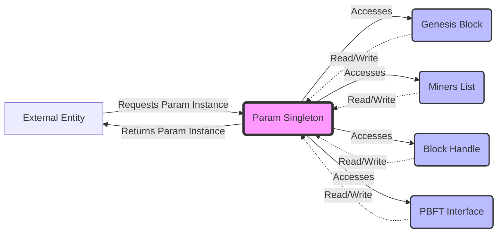

## Module: Param.java
- **模块名称**：Param.java

- **主要目标**：该模块的目的是提供一个中央配置点，用于管理和配置共识机制的参数，确保系统的灵活性和可配置性。

- **关键函数**：
  - `getInstance()`: 用于获取Param类的单例实例，确保全局只有一个参数配置实例。
  - `getMiner()`: 返回列表中的第一个矿工对象，用于获取当前的矿工信息。

- **关键变量**：
  - `enable`: 表示是否启用某功能的布尔值。
  - `needSyncCheck`: 表示是否需要进行同步检查的布尔值。
  - `minParticipationRate`: 最小参与率。
  - `blockProduceTimeoutPercent`: 出块超时百分比。
  - `genesisBlock`: 创世区块的配置。
  - `miners`: 矿工列表。
  - `blockHandle`: 区块处理器。
  - `agreeNodeCount`: 达成共识所需的节点数量。
  - `pbftInterface`: PBFT接口实现。

- **相互依赖性**：该模块与系统的其他组件（如区块处理器、PBFT接口实现）有密切的交互，用于共识机制的实施和区块的生产。

- **核心与辅助操作**：
  - 核心操作：管理和配置共识机制的参数。
  - 辅助操作：提供获取单个矿工信息的功能。

- **操作序列**：首先通过`getInstance()`方法确保Param类的单例实例被正确创建和获取，然后通过其他getter和setter方法进行参数的配置和读取。

- **性能方面**：考虑到该模块在共识机制中的中心角色，性能主要体现在参数读取和设置的效率上，以及通过单例模式减少资源消耗。

- **可重用性**：该模块设计为高度可配置和可重用，可以根据不同的共识机制和区块链项目需求进行调整。

- **使用**：在区块链系统的启动和运行过程中，该模块被用来配置和调整共识机制的相关参数，确保系统按预期工作。

- **假设**：
  - 系统中存在一个有效的共识机制。
  - 矿工列表已经被正确初始化和配置。

通过上述分析，我们可以看出Param模块在区块链系统中扮演着配置和管理共识机制参数的关键角色，它通过提供灵活的配置选项支持系统的可扩展性和可维护性。
## Flow Diagram [via mermaid]

