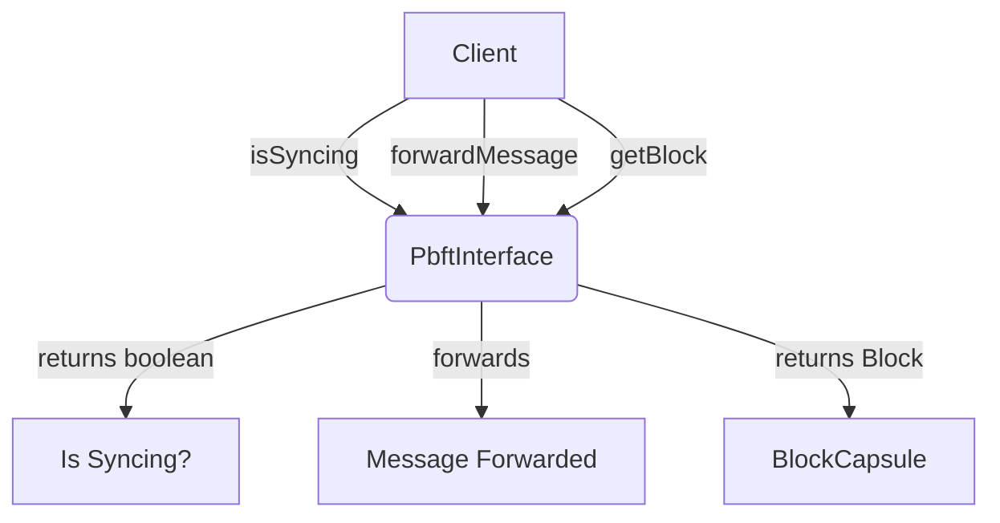

## Module: PbftInterface.java
- **模块名称**：PbftInterface.java

- **主要目标**：该模块的目的是定义一个接口，用于实现PBFT(Practical Byzantine Fault Tolerance)共识机制中的基本操作。PBFT是一种用于分布式系统的容错机制，旨在解决拜占庭将军问题，确保系统即使在部分节点存在故障或恶意攻击的情况下也能正常运行。

- **关键函数**：
  - `isSyncing()`：该方法用于判断节点是否正在同步区块数据。
  - `forwardMessage(PbftBaseMessage message)`：用于转发PBFT基本消息，这在共识过程中的消息交换是必要的。
  - `getBlock(long blockNum)`：根据区块编号获取区块数据，如果无法获取则抛出异常。

- **关键变量**：由于这是一个接口，因此直接在接口中不定义变量，但它预设了实现它的类需要处理的关键数据，例如区块编号和PBFT消息。

- **互依赖性**：此接口依赖于`org.tron.consensus.pbft.message.PbftBaseMessage`类（用于处理PBFT消息）和`org.tron.core.capsule.BlockCapsule`类（用于处理区块数据）。它与系统中处理区块链同步和消息转发的其他组件相互作用。

- **核心与辅助操作**：`isSyncing()`和`getBlock(long blockNum)`可视为核心操作，因为它们直接关系到区块链数据的同步和获取。`forwardMessage(PbftBaseMessage message)`虽然对于消息传递机制非常重要，但可以视为辅助操作，因为它支持共识过程的通讯需求。

- **操作序列**：在PBFT共识机制中，节点首先需要确保自己的数据是最新的（通过`isSyncing()`检查），然后在共识过程中转发和接收消息（通过`forwardMessage`实现），最后获取或验证特定的区块数据（通过`getBlock`实现）。

- **性能方面**：在实现此接口时，性能考虑包括消息处理的效率、区块数据同步的速度以及异常处理机制。

- **可重用性**：此接口的设计允许不同的区块链项目或不同的PBFT实现方案重用，只要它们遵循相同的基本操作原则。

- **使用**：在实现PBFT共识机制的区块链系统中，此接口被实现用于处理节点间的同步、消息转发和区块获取。

- **假设**：实现此接口的类假设网络环境稳定，节点之间的通信是安全的，且所有节点均尝试遵守PBFT协议。此外，还假设异常情况（如数据获取失败）将通过适当的异常处理机制得到处理。
## Flow Diagram [via mermaid]

