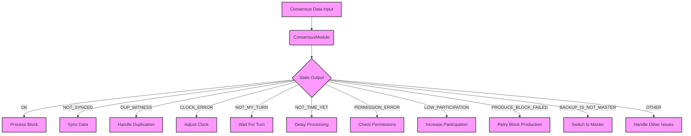

## Module: State.java
**模块名称**: State.java

**主要目的**: 该模块是定义在`org.tron.consensus.base`包下的一个枚举类型，旨在表示区块链共识过程中可能遇到的各种状态。这些状态反映了区块生产者在生产区块时可能遇到的不同情况，例如同步状态、见证人重复、时间错误等。

**关键函数**: 作为枚举类型，State.java本身不包含方法（函数），但它定义的枚举值在系统的其他部分被用来控制逻辑流程和决策。

**关键变量**:
- `OK`: 表示一切正常，可以生产区块。
- `NOT_SYNCED`: 表示节点没有同步。
- `DUP_WITNESS`: 表示出现见证人重复。
- `CLOCK_ERROR`: 表示时钟错误。
- `NOT_MY_TURN`: 表示当前不是该节点生产区块的轮次。
- `NOT_TIME_YET`: 表示还未到生产区块的时间。
- `PERMISSION_ERROR`: 表示权限错误。
- `LOW_PARTICIPATION`: 表示参与度低。
- `PRODUCE_BLOCK_FAILED`: 表示生产区块失败。
- `BACKUP_IS_NOT_MASTER`: 备份不是主节点。
- `OTHER`: 表示其他错误。

**相互依赖性**: 该模块与系统中负责区块生产、时间管理、权限控制等其他组件有交互。枚举值通常被用于决策逻辑，以确定如何响应特定的系统状态。

**核心与辅助操作**: 本模块定义的枚举值是核心操作的一部分，它们用于区块链共识机制的核心逻辑判断。没有直接的辅助操作，但这些状态对于整个系统的稳定运行和决策逻辑至关重要。

**操作顺序**: 由于本模块是枚举类型，没有特定的操作顺序。但在使用这些枚举值的系统其他部分中，会有明确的逻辑流程，根据不同的状态执行不同的操作。

**性能方面**: 枚举类型本身对性能影响很小，但它们代表的状态在整个系统中如何被处理可能会对性能有重大影响。例如，频繁的`NOT_SYNCED`状态可能表明同步机制需要优化。

**可重用性**: 由于这些状态是针对特定的区块链共识过程设计的，它们的可重用性主要局限于类似的区块链系统或需要类似状态管理的系统中。

**使用方式**: 在区块链系统的共识机制中，根据当前节点的状态（如是否同步、是否轮到生产区块等），使用这些枚举值来控制决策逻辑，如是否开始生产区块、是否需要进行同步等。

**假设**:
- 假设系统时间准确，以便正确处理`CLOCK_ERROR`和`NOT_TIME_YET`等状态。
- 假设所有节点均遵循共识规则，以确保`LOW_PARTICIPATION`等状态的准确性。
- 假设有有效的错误处理机制，以应对`PRODUCE_BLOCK_FAILED`等状态。
## Flow Diagram [via mermaid]

