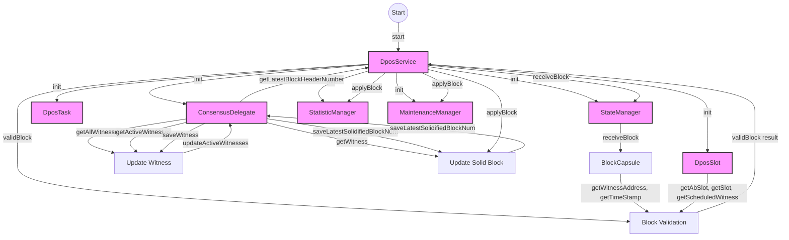

## Module: DposService.java
- **模块名称**: DposService.java

- **主要目标**: 该模块的目的是实现Delegated Proof of Stake (DPOS) 共识机制的核心功能，包括见证人的选举、区块的生产与验证等。

- **关键函数**:
  - `start(Param param)`: 初始化并启动DPOS服务。
  - `stop()`: 停止DPOS服务。
  - `receiveBlock(BlockCapsule blockCapsule)`: 接收并处理新的区块。
  - `validBlock(BlockCapsule blockCapsule)`: 验证区块的有效性。
  - `applyBlock(BlockCapsule blockCapsule)`: 应用区块到区块链上。
  - `updateSolidBlock()`: 更新已确认的区块数量。
  - `updateWitness(List<ByteString> list)`: 更新见证人列表。

- **关键变量**:
  - `miners`: 存储矿工信息的映射。
  - `genesisBlockTime`: 创世区块的时间戳。
  - `enable`: 表示DPOS服务是否启用。
  - `needSyncCheck`: 表示是否需要进行同步检查。

- **交互依赖**:
  - 与`ConsensusDelegate`、`DposTask`、`DposSlot`、`StateManager`、`StatisticManager`和`MaintenanceManager`等组件交互，共同完成DPOS共识机制的操作。

- **核心 vs. 辅助操作**:
  - 核心操作包括见证人的选举、区块的生产与验证。
  - 辅助操作包括同步检查、统计信息的更新等。

- **操作序列**:
  - 在启动时，初始化并设置相关参数，包括见证人的更新和初始状态的设置。
  - 接收并处理新的区块，进行区块的验证和应用。
  - 定期更新已确认的区块数量和见证人列表。

- **性能方面**:
  - 需要高效地处理区块的接收、验证和应用，以及见证人列表的更新，以确保区块链的稳定运行和高吞吐量。

- **可重用性**:
  - 该模块设计为可重用的组件，可以在需要实现DPOS共识机制的区块链项目中使用。

- **使用**:
  - 通常作为区块链系统的一部分，负责实现DPOS共识机制，包括见证人的管理和区块的处理。

- **假设**:
  - 假设所有参与节点均遵守DPOS规则，且网络连接稳定，以确保共识机制的正常运行。
## Flow Diagram [via mermaid]

