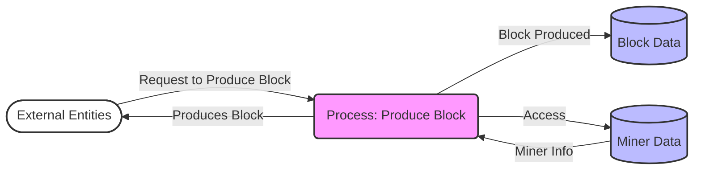

## Module: DposTask.java
由于您请求的分析较为复杂，我将尽量提供详尽的分析。请注意，这是基于您提供的`DposTask.java`模块的分析。

- **模块名称**: `DposTask`

- **主要目标**: 该模块的目的是在分布式权益证明（DPoS）共识机制中负责区块的生产。

- **关键函数**:
  - `init()`: 初始化区块生产任务，包括设置生产执行器和启动生产区块的循环。
  - `stop()`: 停止区块生产任务。
  - `produceBlock()`: 生产区块的核心逻辑，包括检查是否轮到当前节点生产区块，以及实际的区块生产过程。

- **关键变量**:
  - `consensusDelegate`: 共识委托，用于与共识相关的操作。
  - `dposSlot`: DPoS时隙管理器，用于管理生产区块的时隙。
  - `stateManager`: 状态管理器，用于管理当前节点的状态。
  - `produceExecutor`: 生产执行器，用于异步执行区块生产任务。
  - `isRunning`: 表示区块生产任务是否正在运行。

- **交互依赖**:
  - 该模块与`ConsensusDelegate`、`DposSlot`、`StateManager`等模块紧密交互，共同负责DPoS共识机制下的区块生产和状态管理。

- **核心 vs. 辅助操作**:
  - 核心操作是`produceBlock()`，即生产区块的过程。
  - 辅助操作包括初始化(`init()`)和停止(`stop()`)区块生产任务。

- **操作序列**:
  - 初始化时，配置生产执行器并启动一个循环任务，定期检查是否需要生产区块。
  - 当满足生产区块的条件时，执行`produceBlock()`生产区块。
  - 可以通过`stop()`方法停止区块生产任务。

- **性能考虑**:
  - 该模块需要高效地管理时间和状态，确保区块能够及时且正确地生产。
  - 对于异常和错误情况的处理需要优化，以减少对区块生产的影响。

- **可重用性**:
  - 该模块的设计允许它在不同的DPoS基础的区块链系统中重用，只需适当的配置和集成。

- **使用**:
  - 该模块被设计为DPoS共识机制下的区块链系统的一部分，用于管理和执行区块的生产。

- **假设**:
  - 假设系统的其他部分（如状态管理和时隙管理）能够正常工作，以支持区块的生产。
  - 假设网络和系统资源（如CPU、内存）足够支持区块的生产和处理。

这是基于提供的代码片段的分析，可能不完全准确。如果有更具体的需求或问题，请提供更多的上下文。
## Flow Diagram [via mermaid]

