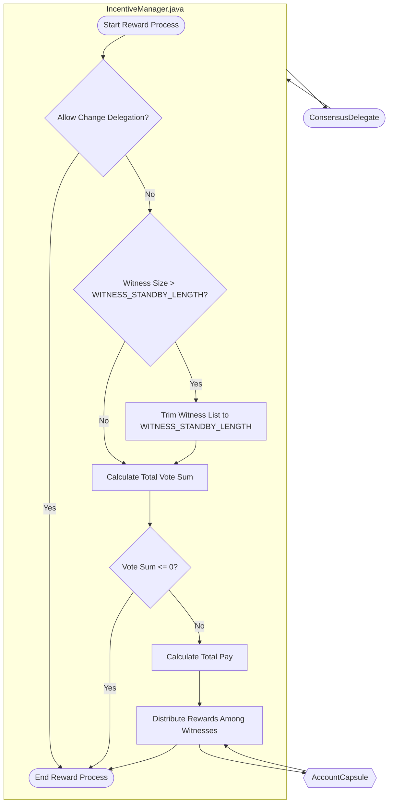

## Module: IncentiveManager.java
**模块名称**：IncentiveManager.java

**主要目标**：该模块的目的是管理区块链网络中见证人（witnesses）的奖励分配机制。

**关键函数**：
- `reward(List<ByteString> witnesses)`：这是主要的方法，负责计算并分配奖励给见证人。它首先检查是否允许改变委托，然后基于见证人的投票总数来分配奖励。

**关键变量**：
- `consensusDelegate`：一个与共识相关的委托，用于访问见证人的投票计数、获取见证人待遇和保存账户信息等。

**依赖关系**：
- 该模块依赖于`ConsensusDelegate`接口，用于实现与共识机制相关的操作，如获取见证人信息、账户信息等。

**核心与辅助操作**：
- 核心操作是奖励分配逻辑，即`reward`方法的实现。
- 辅助操作包括与`ConsensusDelegate`接口的交互，用于获取必要的数据和执行账户更新。

**操作序列**：
1. 检查是否允许更改委托。
2. 如果见证人数量超过了预设的长度，进行截取。
3. 计算投票总数。
4. 如果投票总数大于0，计算每个见证人的奖励并更新其账户余额。

**性能方面**：
- 性能考虑主要集中在有效地计算奖励分配，以及与`ConsensusDelegate`的交互上，尤其是在处理大量见证人时。

**可重用性**：
- 该模块设计为特定于Tron区块链的共识机制，但其奖励分配的基本逻辑和模式可以适应于其他具有类似共识机制的区块链系统。

**使用**：
- 主要用于在区块链网络中执行见证人奖励分配的周期性任务。

**假设**：
- 假设`consensusDelegate`能够提供准确的见证人投票计数和账户信息。
- 假设见证人的列表已经按照某种标准进行了预筛选或排序。
## Flow Diagram [via mermaid]

