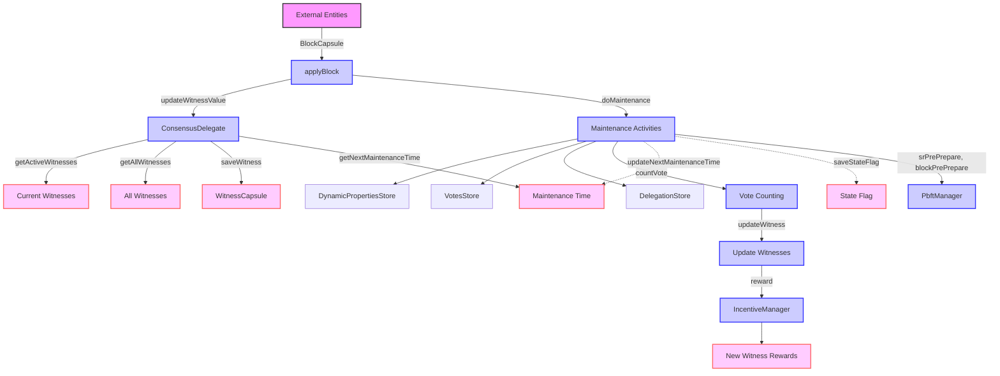

## Module: MaintenanceManager.java
- **模块名称**: MaintenanceManager.java

- **主要目标**: 此模块的主要目的是管理区块链系统中的见证人维护操作，包括见证人的更新、投票计数以及奖励分配等。

- **关键功能**:
  - `init()`: 初始化当前活跃见证人列表。
  - `applyBlock(BlockCapsule blockCapsule)`: 应用新区块到维护管理器，触发维护操作。
  - `doMaintenance()`: 执行维护操作，更新见证人，处理投票和奖励。
  - `updateWitnessValue(List<ByteString> srList)`: 更新见证人列表。
  - `countVote(VotesStore votesStore)`: 计算投票结果。
  - `tryRemoveThePowerOfTheGr()`: 尝试移除GR的权力。

- **关键变量**:
  - `beforeWitness` 和 `currentWitness`: 分别存储维护前后的见证人列表。
  - `beforeMaintenanceTime`: 上一次维护操作的时间。

- **互相依赖**:
  - 与`ConsensusDelegate`, `IncentiveManager`, `DposService`, `PbftManager`, `VotesStore`, `DynamicPropertiesStore`, 和 `DelegationStore`等组件有交互，用于获取见证人信息，投票信息，以及执行奖励分配等。

- **核心 vs. 辅助操作**:
  - 核心操作包括见证人列表的更新、投票计数、奖励分配等。
  - 辅助操作包括初始化和日志记录等。

- **操作顺序**:
  - 在每个区块应用时，检查是否到达下一个维护时间，如果是，则执行`doMaintenance`进行维护操作，包括更新见证人、处理投票和奖励。

- **性能方面**:
  - 性能考虑主要集中在高效地处理投票计数和见证人列表的更新上，以确保区块链的高吞吐和低延迟。

- **可复用性**:
  - 该模块设计为可复用的组件，可以在不同的区块链项目中实现见证人维护和投票管理。

- **使用**:
  - 主要用于支持基于DPoS和PBFT共识机制的区块链系统中的维护操作。

- **假设**:
  - 假设所有输入的区块和见证人信息是有效的。
  - 假设系统中的时间同步准确，以确保维护操作按计划执行。
## Flow Diagram [via mermaid]

