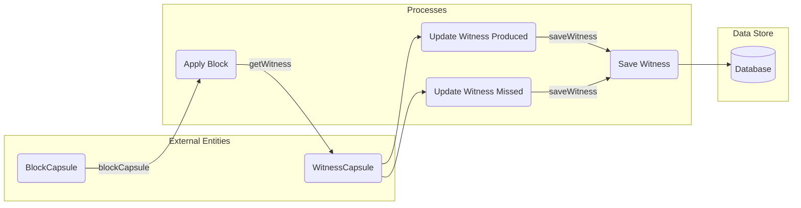

## Module: StatisticManager.java
**模块名称**：StatisticManager.java

**主要目标**：StatisticManager 的主要目的是管理和统计区块链共识过程中的数据，包括见证人的生产和缺失区块的情况。

**关键功能**：
- `applyBlock(BlockCapsule blockCapsule)`: 这个方法用于处理每个区块的应用，更新见证人的统计数据（如生产的区块总数和最新的区块号），并记录成功或缺失的挖矿事件。

**关键变量**：
- `consensusDelegate`: 用于访问共识相关的操作和数据。
- `dposSlot`: 用于管理DPoS共识算法中的时间槽位。

**相互依赖性**：
- 与`ConsensusDelegate`和`DposSlot`类有直接的依赖关系，用于执行共识相关的操作和计算。
- 使用`Metrics`类来记录和统计数据。

**核心与辅助操作**：
- 核心操作包括更新见证人统计信息和记录挖矿事件。
- 辅助操作包括日志记录和字符串编码。

**操作序列**：
1. 对于每个传入的区块，首先更新见证人的生产区块总数。
2. 然后，根据区块时间计算出当前的槽位号，并更新见证人的最新区块号和槽位号。
3. 如果区块号不是1，还会为之前的每个槽位找到计划中的见证人，并更新其缺失区块的总数。

**性能方面**：
- 性能考虑包括减少数据库访问次数和优化数据结构以快速检索和更新统计数据。

**可重用性**：
- 该模块的设计允许在不同的区块链项目中重用，特别是采用DPoS共识机制的项目。

**使用**：
- 在区块链系统中，每当一个新区块被应用到区块链上时，都会调用此模块来更新相关的统计信息。

**假设**：
- 假设所有的见证人地址和区块信息都是有效的。
- 假设时间戳和区块号是按正确的顺序生成的，没有时间漂移或重复的问题。
## Flow Diagram [via mermaid]

