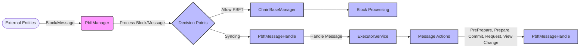

## Module: PbftManager.java
基于提供的代码模块，以下是用中文进行的综合分析：

- **模块名称**：PbftManager.java

- **主要目标**：该模块的目的是管理PBFT（实用拜占庭容错）共识过程中的消息处理，包括预准备、准备、提交等阶段的消息处理。

- **关键功能**：
  - `init()`：初始化函数，设置维护管理器和消息处理器。
  - `blockPrePrepare()`：处理区块的预准备阶段。
  - `srPrePrepare()`：处理特权节点的区块预准备阶段。
  - `forwardMessage()`：转发PBFT消息。
  - `doAction()`：根据PBFT消息类型调用相应的处理函数。
  - `verifyMsg()`：验证消息的合法性。
  - `close()`：关闭时清理资源，例如关闭执行服务。

- **关键变量**：
  - `pbftMessageHandle`：负责PBFT消息的处理。
  - `maintenanceManager`：维护管理器，管理维护模式和见证人列表。
  - `chainBaseManager`：链基础管理器，负责区块链的基础操作。
  - `executorService`：执行服务，用于异步处理消息。

- **依赖关系**：
  - 与`PbftMessageHandle`、`MaintenanceManager`和`ChainBaseManager`等组件紧密合作，共同完成PBFT共识机制的消息处理。

- **核心与辅助操作**：
  - 核心操作包括处理PBFT共识过程中的各种消息。
  - 辅助操作包括消息的验证和转发。

- **操作序列**：
  - 初始化 -> 消息预准备 -> 消息处理（根据类型）-> 验证消息 -> 资源清理。

- **性能方面**：
  - 通过异步处理消息（使用`ExecutorService`），提高了消息处理的效率和响应速度。

- **可重用性**：
  - 该模块设计为可重用的组件，可以在不同的PBFT共识场景中使用。

- **使用**：
  - 主要用于TRON网络中PBFT共识机制的实现，处理共识过程中的消息。

- **假设**：
  - 假设所有输入的消息都是有效的，且系统的其他部分（如`MaintenanceManager`和`ChainBaseManager`）已正确配置和初始化。

这个分析基于代码模块的结构和功能，旨在提供对模块设计和操作的全面理解。
## Flow Diagram [via mermaid]

