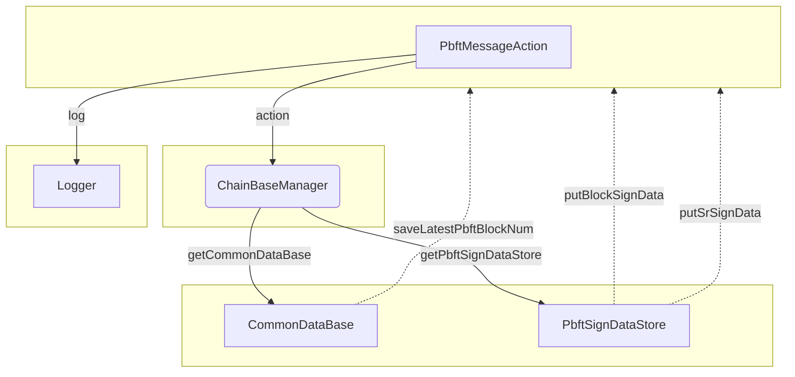

## Module: PbftMessageAction.java
**模块名称**：PbftMessageAction.java

**主要目标**：该模块的目的是处理PBFT（实用拜占庭容错）消息的动作，包括对区块和特定请求（如SR请求）的签名数据的存储和管理。

**关键功能**：
- `action(PbftMessage message, List<ByteString> dataSignList)`：根据PBFT消息的类型（如区块或SR），执行相应的操作，例如保存最新的PBFT区块编号或存储签名数据。

**关键变量**：
- `chainBaseManager`：用于管理区块链基础数据和PBFT签名数据的存储。

**相互依赖性**：
- 该模块依赖于`ChainBaseManager`来实现对共识数据的存取，显示了与系统其他组件的交互。

**核心与辅助操作**：
- 核心操作包括处理PBFT消息并根据消息类型更新存储的数据。
- 辅助操作可能包括日志记录等。

**操作序列**：
- 根据PBFT消息的类型（BLOCK或SRL），选择不同的处理流程，如保存区块编号或处理SR签名数据。

**性能方面**：
- 性能考虑可能包括如何高效地存取和管理PBFT相关的数据，以及如何确保操作的高效执行。

**可重用性**：
- 该模块设计用于处理PBFT消息，可以在需要PBFT共识机制的其他区块链项目中重用或适应。

**使用**：
- 在需要PBFT共识机制处理消息时使用，如在区块链网络中确认区块或请求的有效性。

**假设**：
- 假设系统的其他部分（如`ChainBaseManager`）已正确实现和配置，以确保PBFT消息的正确处理。

请注意，这个分析是基于提供的代码片段生成的，可能不完全准确或全面。如果有更详细的代码上下文或具体需求，可以提供更具体的分析。
## Flow Diagram [via mermaid]

