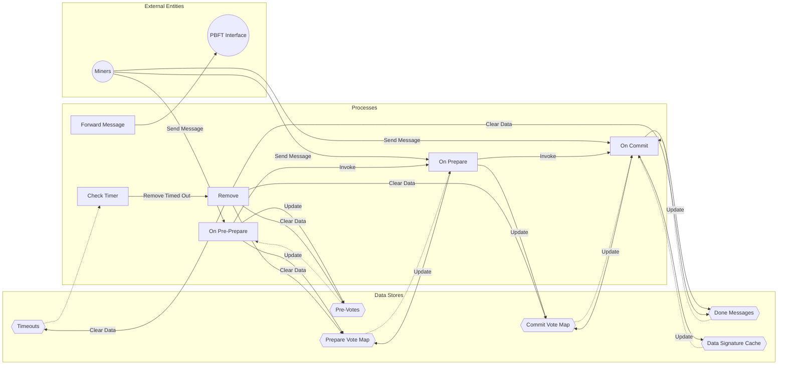

## Module: PbftMessageHandle.java
由于代码的复杂性和详细性，下面是对`PbftMessageHandle.java`模块的全面分析概述，使用中文进行描述：

- **模块名称**：PbftMessageHandle.java

- **主要目标**：该模块的目的是处理PBFT（实用拜占庭容错）共识算法中的消息，包括预准备、准备和提交阶段的消息处理。

- **关键函数**：
  - `onPrePrepare(PbftMessage message)`：处理预准备阶段的消息。
  - `onPrepare(PbftMessage message)`：处理准备阶段的消息。
  - `onCommit(PbftMessage message)`：处理提交阶段的消息。
  - `start()`：启动定时器，定期检查超时。
  - `remove(String no)`：清理特定编号的消息状态。
  - `checkIsCanSendMsg(long epoch)`：检查是否可以发送消息。

- **关键变量**：
  - `preVotes`：存储预准备阶段的投票信息。
  - `pareVoteMap`、`agreePare`：存储准备阶段的投票信息。
  - `commitVoteMap`、`agreeCommit`：存储提交阶段的投票信息。
  - `timeOuts`：存储消息的超时信息。

- **依赖性**：与`PbftMessageAction`、`MaintenanceManager`和`ChainBaseManager`等其他系统组件交互，用于消息的转发、维护管理和链基础管理。

- **核心操作与辅助操作**：
  - 核心操作包括处理PBFT共识的三个阶段的消息。
  - 辅助操作包括启动定时器、检查超时、清理状态等。

- **操作序列**：首先处理预准备消息，然后是准备消息，最后是提交消息。每个阶段都对消息进行验证和转发。

- **性能方面**：使用了缓存和并发集合来提高消息处理的效率和性能。

- **可重用性**：该模块设计为可重用的组件，可以在需要PBFT共识处理的其他项目中使用。

- **使用**：主要用于实现PBFT共识算法，在区块链系统中确保数据的一致性和安全。

- **假设**：假设所有参与者都遵循PBFT协议的规则，网络环境稳定。

这个分析提供了`PbftMessageHandle.java`模块的一个全面概览，包括它的目的、关键功能、操作序列和性能方面的考虑。
## Flow Diagram [via mermaid]

