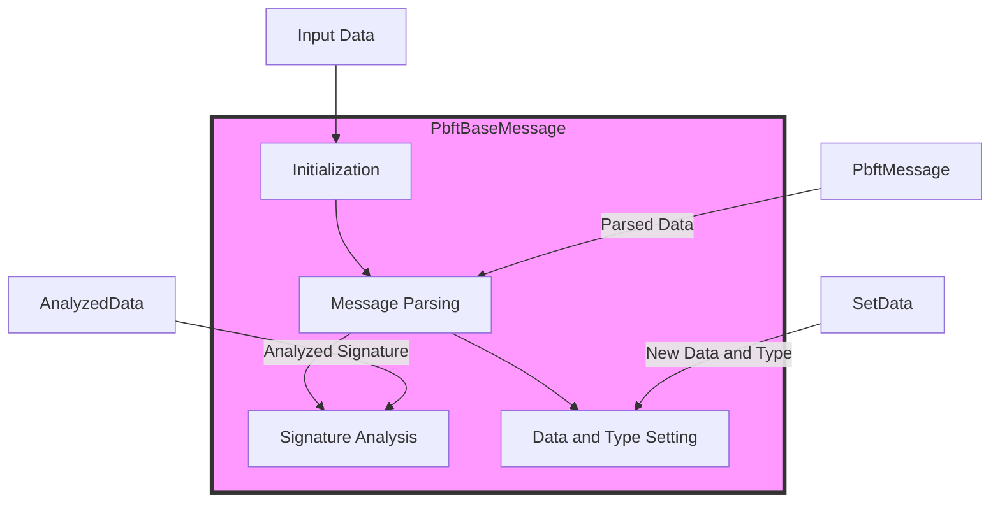

## Module: PbftBaseMessage.java
**模块名称**：PbftBaseMessage.java

**主要目标**：定义一个抽象类，该类是处理PBFT（实用拜占庭容错）消息的基础，旨在为不同类型的PBFT消息提供一个共同的基础结构。

**关键功能**：
- 构造函数：初始化消息，解析PBFT消息内容。
- `getPbftMessage()`：获取PBFT消息实例。
- `setPbftMessage(PBFTMessage pbftMessage)`：设置PBFT消息实例。
- `isSwitch()`：判断是否为切换消息。
- `setSwitch(boolean aSwitch)`：设置切换标志。
- `setData(byte[] data)`：设置消息数据。
- `setType(byte type)`：设置消息类型。
- `getPublicKey()`：获取公钥。
- `getKey()`：生成基于编号和公钥的键。
- `getDataKey()`：生成基于编号和消息数据的键。
- `getNumber()`：获取视图编号。
- `getEpoch()`：获取纪元编号。
- `getDataType()`：获取数据类型。
- `getNo()`：获取消息编号（抽象方法，需由子类实现）。
- `analyzeSignature()`：分析并验证消息签名。
- `toString()`：生成消息的字符串表示。
- `getDataString()`：获取消息数据的字符串表示。
- `decode()`：解码特定类型的数据。

**关键变量**：
- `pbftMessage`：存储PBFT消息的实例。
- `isSwitch`：标识是否为切换消息的布尔值。
- `publicKey`：消息签名者的公钥。

**相互依赖性**：该模块依赖于`org.tron.protos.Protocol`中的`PBFTMessage`类来解析和处理PBFT消息数据，同时也依赖于`org.tron.common.crypto.ECKey`和`org.tron.core.capsule.TransactionCapsule`等类进行签名的验证和处理。

**核心与辅助操作**：
- 核心操作包括消息的解析、签名验证和基本信息的获取。
- 辅助操作包括设置消息类型、数据以及切换状态等。

**操作序列**：首先通过构造函数或`setData`和`setType`方法初始化消息，然后可以通过`analyzeSignature`方法验证消息的签名，最后可以通过各种getter方法获取消息的详细信息。

**性能方面**：性能考虑主要集中在消息解析和签名验证上，需要高效处理大量的消息验证操作。

**可重用性**：作为一个抽象类，`PbftBaseMessage`旨在被继承和扩展以支持不同类型的PBFT消息，具有很好的可重用性。

**使用**：在PBFT协议实现中，不同类型的PBFT消息会继承此类，通过扩展不同的方法来实现特定的功能。

**假设**：该模块假设所有传入的消息数据都是有效的PBFT协议消息，并且所有的签名都是可以验证的。
## Flow Diagram [via mermaid]

