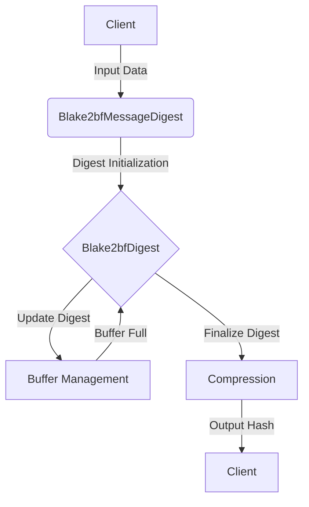

## Module: Blake2bfMessageDigest.java
根据提供的代码模块，以下是用中文进行的综合分析：

- **模块名称**：Blake2bfMessageDigest.java

- **主要目标**：该模块的目的是实现Blake2b密码哈希函数的`F`压缩功能，特别是针对64位平台进行了优化。

- **关键函数**：
  - `Blake2bfDigest()`：构造函数，初始化内部状态。
  - `update(byte in)`和`update(byte[] in, int offset, int len)`：用于更新消息摘要。
  - `doFinal(byte[] out, int offset)`：关闭摘要，产生最终的摘要值，并重置摘要状态。
  - `reset()`：重置摘要到初始状态。
  - `compress()`：执行BLAKE2b的压缩功能。

- **关键变量**：
  - `MESSAGE_LENGTH_BYTES`：消息长度（字节）。
  - `IV`：初始化向量。
  - `PRECOMPUTED`：预计算的数组，用于压缩函数。
  - `buffer`：保存序列化输入的缓冲区。
  - `h`, `m`, `t`, `v`：分别代表状态向量、消息块向量、偏移计数器和中间状态向量。

- **相互依赖性**：该模块依赖于`org.bouncycastle`库中的类和方法，特别是用于实现摘要接口和处理字节操作的工具方法。

- **核心与辅助操作**：
  - 核心操作包括初始化、更新状态、压缩和产生最终摘要值。
  - 辅助操作包括重置摘要状态和执行字节转换的辅助方法。

- **操作序列**：首先通过`update`方法更新状态，然后使用`doFinal`方法完成压缩并产生最终的摘要值，最后可以通过`reset`方法重置状态。

- **性能方面**：该模块针对64位平台进行了优化，但具体性能表现会根据实际使用情况和环境而异。

- **可重用性**：作为一个独立的消息摘要实现，该模块可以在需要BLAKE2b压缩功能的任何场合中重用。

- **使用**：该模块适用于需要高安全性的密码学应用中，例如加密货币、安全通信协议等。

- **假设**：
  - 假设使用的平台是64位的，以确保最佳性能。
  - 假设输入的数据长度和格式符合BLAKE2b算法的要求。

这个分析提供了对`Blake2bfMessageDigest.java`模块功能和实现细节的全面概述。
## Flow Diagram [via mermaid]

