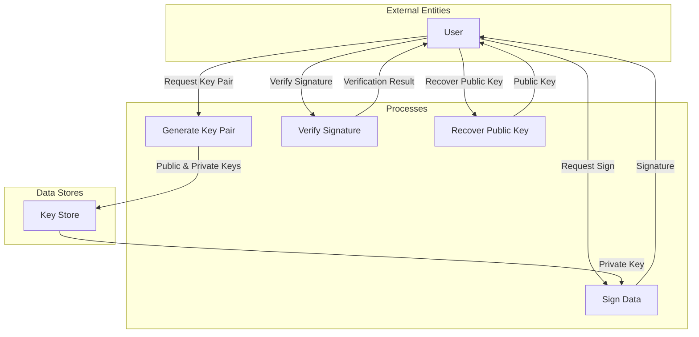

## Module: ECKey.java
- **模块名称**：ECKey.java

- **主要目标**：该模块的目的是提供一个用于生成和管理椭圆曲线密钥对（包括公钥和私钥）的工具，特别是在加密和数字签名方面的应用。

- **关键功能**：
  - `ECKey()`：生成一个全新的密钥对。
  - `fromPrivate(BigInteger privKey)` 和 `fromPrivate(byte[] privKeyBytes)`：从给定的私钥生成ECKey实例。
  - `fromPublicOnly(ECPoint pub)` 和 `fromPublicOnly(byte[] pub)`：从给定的公钥生成一个只能用于验证签名的ECKey实例。
  - `sign(byte[] messageHash)`：使用私钥对给定的消息哈希进行签名。
  - `verify(byte[] messageHash, ECDSASignature signature)`：使用公钥验证给定消息哈希的签名。
  - `getPubKey()` 和 `getPrivKeyBytes()`：分别获取公钥和私钥的字节表示。

- **关键变量**：
  - `pub`：公钥点。
  - `privKey`：私钥对象。
  - `CURVE` 和 `CURVE_SPEC`：定义了椭圆曲线的参数。

- **相互依赖性**：
  - 与Bouncy Castle库紧密集成，用于加密操作和椭圆曲线算法的实现。
  - 依赖于`SecureRandom`实例来生成安全的随机数。

- **核心与辅助操作**：
  - 核心操作包括密钥生成、签名和验证。
  - 辅助操作包括公钥和私钥的获取、转换和压缩点的实用方法。

- **操作序列**：
  - 通常，首先生成或提供密钥（公钥、私钥或两者），然后使用这些密钥进行签名或验证操作。

- **性能方面**：
  - 性能考虑主要涉及到加密操作的效率和安全性，特别是在生成密钥和签名过程中的随机数生成。

- **可重用性**：
  - 该模块设计为可重用，可以轻松集成到需要椭圆曲线密钥管理和加密操作的应用中。

- **使用**：
  - 用于区块链和加密货币钱包中，进行交易签名和验证。

- **假设**：
  - 假设使用的是secp256k1椭圆曲线参数，这是许多加密货币项目的标准选择。

此分析基于代码的结构和功能，为了确保准确性，可能需要根据实际应用场景进行调整。
## Flow Diagram [via mermaid]

