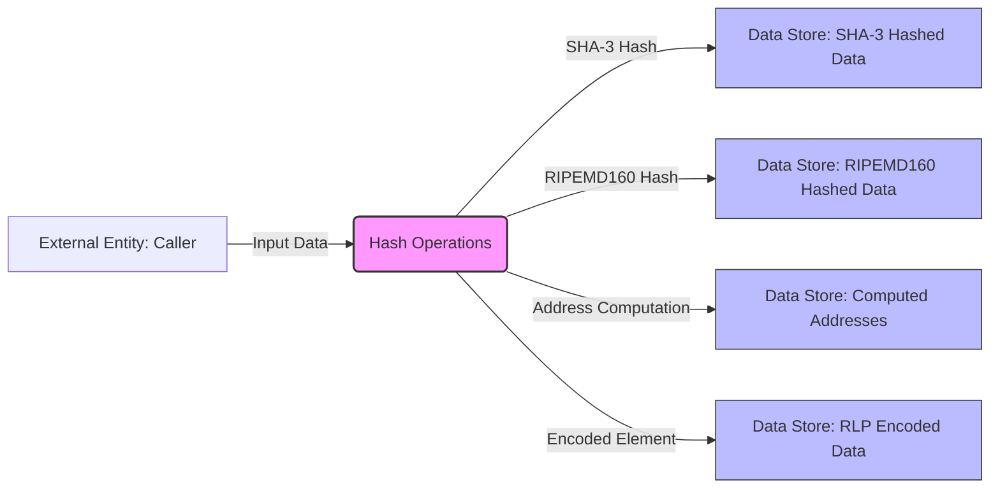

## Module: Hash.java
模块名称：Hash.java

**主要目标**：该模块的主要目的是提供加密散列功能，包括对数据执行SHA-3散列和RIPEMD-160散列，以及相关的加密操作，用于支持区块链技术中的数据完整性和安全性验证。

**关键函数**：
- `sha3(byte[] input)`：对输入数据进行SHA-3散列。
- `sha3(byte[] input1, byte[] input2)`：对两部分输入数据进行合并后执行SHA-3散列。
- `sha3(byte[] input, int start, int length)`：对输入数据的特定部分进行SHA-3散列。
- `encodeElement(byte[] srcData)`：对数据进行RLP编码。
- `computeAddress(ECPoint pubPoint)`和`computeAddress(byte[] pubBytes)`：根据公钥计算地址。
- `sha3omit12(byte[] input)`：计算SHA-3散列并省略前12个字节，常用于地址计算。
- `ripemd160(byte[] data)`：对数据执行RIPEMD-160散列。

**关键变量**：
- `EMPTY_TRIE_HASH`：空Trie的散列值。
- `CRYPTO_PROVIDER`：加密服务提供者。
- `HASH_256_ALGORITHM_NAME`和`HASH_512_ALGORITHM_NAME`：散列算法的名称。

**相互依赖性**：该模块依赖于Java安全框架和Bouncy Castle库来提供加密算法的实现。

**核心与辅助操作**：
- 核心操作包括SHA-3和RIPEMD-160散列计算。
- 辅助操作包括数据的RLP编码和地址计算。

**操作序列**：通常，数据首先通过`encodeElement`进行编码，然后使用`sha3`或`ripemd160`方法进行散列计算。

**性能方面**：散列操作的性能取决于输入数据的大小和使用的加密算法。优化数据处理和算法选择可以提高性能。

**可重用性**：该模块提供的加密散列功能是通用的，可以在不同的区块链项目和加密应用中重用。

**使用**：在区块链技术中，该模块用于生成交易的散列、验证数据的完整性、计算账户地址等。

**假设**：
- 假设加密提供者已正确安装并配置。
- 假设输入数据是有效的，即在进行散列计算之前不需要额外的验证。
## Flow Diagram [via mermaid]

