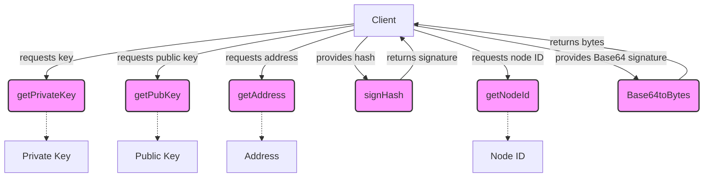

## Module: SignInterface.java
由于原始请求中没有提供具体的代码实现，以下分析基于上述接口声明进行：

- **模块名称**：SignInterface.java

- **主要目标**：定义了一个加密签名接口，用于生成和管理加密密钥、地址、签名等与加密相关的操作。

- **关键函数**：
  - `getPrivateKey()`：获取私钥。
  - `getPubKey()`：获取公钥。
  - `getAddress()`：获取地址。
  - `signHash(byte[] hash)`：对给定的哈希值进行签名。
  - `getNodeId()`：获取节点ID。
  - `Base64toBytes(String signature)`：将Base64编码的签名转换为字节数组。

- **关键变量**：此接口定义中不直接展示变量，但关键信息包括私钥、公钥、地址、签名哈希和节点ID。

- **互依赖性**：此接口可能依赖于其他加密、哈希函数库或网络通信模块来实现其功能，但具体依赖项取决于实现细节。

- **核心与辅助操作**：
  - 核心操作包括生成密钥（私钥和公钥）、地址、签名和节点ID的能力。
  - 辅助操作可能包括将签名从Base64格式转换为字节的能力，这对于某些加密或网络传输场景可能很有用。

- **操作序列**：在实际应用中，一般首先生成密钥对（私钥和公钥），然后使用私钥对数据进行签名，公钥用于验证签名。地址和节点ID的生成及使用顺序可能因实际应用场景而异。

- **性能考虑**：加密操作通常是计算密集型的，因此实现时需要考虑到性能优化，尤其是在需要频繁进行加解密操作的场景中。

- **可重用性**：作为一个接口，SignInterface旨在提供一组标准的加密操作，使得不同的实现可以根据具体需求进行替换，从而提高了代码的可重用性和模块化。

- **使用**：此接口可用于需要加密签名功能的任何应用中，如加密货币钱包、安全通信、数字版权管理等。

- **假设**：实现此接口的类假设环境已具备必要的加密库支持。此外，还可能假设调用者具有足够的权限访问和操作密钥等敏感信息。

这个分析基于接口的声明，具体实现细节可能会有所不同。
## Flow Diagram [via mermaid]

