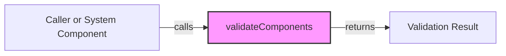

## Module: SignatureInterface.java
由于您没有提供具体的代码实现细节，我将基于您提供的模块信息进行分析。

- **模块名称**：SignatureInterface.java

- **主要目标**：该接口定义了数字签名功能的基本框架，旨在为实现类提供一个统一的方法来验证数字签名的组件。

- **关键函数**：
  - `validateComponents()`：这是接口中唯一的方法，其角色是验证签名的各个组件是否有效。具体实现将取决于实现该接口的类。

- **关键变量**：由于这是一个接口，因此它本身不直接定义变量。关键变量将存在于实现了该接口的类中。

- **相互依赖性**：该接口可能会与实现了该接口的类以及可能调用`validateComponents()`方法的其他系统组件有相互依赖关系。具体依赖关系将取决于系统的其他部分如何与之交互。

- **核心与辅助操作**：在这个接口中，`validateComponents()`方法是核心操作，因为它是接口定义的唯一功能。没有明确的辅助操作，除非实现该接口的类引入了额外的方法。

- **操作序列**：作为一个接口，它不定义具体的操作序列。操作序列将由实现该接口的类的具体实现决定。

- **性能方面**：性能考虑可能包括`validateComponents()`方法的执行时间和资源消耗，这将取决于具体实现的效率。

- **可重用性**：该接口设计为可重用的，因为它提供了一个标准化的方法来验证签名组件。不同的实现可以根据需要针对不同的签名算法或场景来创建。

- **使用**：该接口被用于需要数字签名验证的场景中。实现该接口的类需要提供`validateComponents()`方法的具体实现，以满足特定的签名验证需求。

- **假设**：在定义接口时，可能存在一些假设，例如认为所有实现该接口的类都能有效地验证签名组件，或者假设调用`validateComponents()`方法的环境已经满足了某些先决条件。

请注意，由于缺乏具体的实现细节，以上分析基于接口的定义进行推断。具体的功能和性能特点将取决于该接口的具体实现。
## Flow Diagram [via mermaid]

