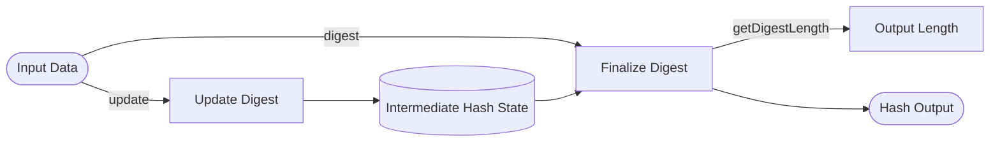

## Module: Digest.java
根据提供的代码模块，下面是用中文进行的综合分析：

- **模块名称**：Digest.java
- **主要目标**：定义了一个加密哈希函数的接口，用于生成数据的摘要或哈希值。这是实现加密安全性的基础组件，特别是在区块链和加密货币（如以太坊）中。
- **关键功能**：
  - `update(byte in)`：向哈希函数输入一个字节的数据。
  - `update(byte[] inbuf)`：向哈希函数输入一个字节数组。
  - `update(byte[] inbuf, int off, int len)`：向哈希函数输入一个字节数组的一部分。
  - `digest()`：完成当前的哈希计算并返回哈希值。
  - `digest(byte[] inbuf)`：输入一些字节，然后完成当前的哈希计算并返回哈希值。
  - `digest(byte[] outbuf, int off, int len)`：完成当前的哈希计算并将哈希值存储在提供的输出缓冲区中。
  - `getDigestLength()`：获取哈希函数输出长度。
  - `reset()`：重置对象，使其适用于新的哈希计算。
  - `copy()`：克隆当前状态。
  - `getBlockLength()`：返回哈希函数的"块长度"。
  - `toString()`：获取此函数的显示名称。
- **关键变量**：无直接变量，但方法参数（如`inbuf`, `off`, `len`）和返回类型（如`byte[]`和`int`）是关键的。
- **相互依赖性**：作为一个接口，`Digest`定义了一系列方法，这些方法可能依赖具体实现中的其他组件或算法来实现具体的加密哈希功能。
- **核心与辅助操作**：核心操作包括数据的更新(`update`)和摘要的生成(`digest`)。辅助操作包括重置(`reset`)和克隆(`copy`)状态，以及获取哈希长度和块长度。
- **操作序列**：通常的操作序列是：初始化 -> 多次`update` -> `digest` -> `reset`（如果需要再次使用）。
- **性能方面**：性能考虑可能包括哈希计算的速度、内存使用和是否能有效地处理大量数据。
- **可重用性**：作为一个接口，`Digest`提供了一个标准化的方式来实现不同的哈希算法，使得具体的实现可以在不同的上下文中重用，只要它们遵循这个接口。
- **使用**：在需要数据完整性验证、数字签名或在区块链技术中生成不可逆的数据摘要时使用。
- **假设**：假设使用此接口的实现将遵循加密哈希函数的标准属性，如抗碰撞和隐藏性。

这个分析提供了对`Digest.java`模块的全面了解，包括它的目的、关键功能和使用场景。
## Flow Diagram [via mermaid]

