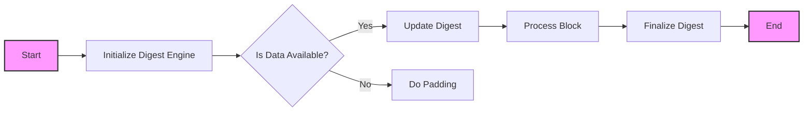

## Module: DigestEngine.java
- **模块名称**：DigestEngine.java

- **主要目标**：该模块的目的是提供一个抽象类，用于实现不同的消息摘要算法。它扩展了`MessageDigest`类，并提供了一个框架，用于处理数据块和生成摘要。

- **关键功能**：
  - `engineReset()`：重置摘要算法的状态。
  - `processBlock(byte[] data)`：处理一个数据块。
  - `doPadding(byte[] buf, int off)`：执行最终的填充并将结果存储在提供的缓冲区中。
  - `doInit()`：在对象创建时调用，用于执行初始化任务。
  - `digest()`、`digest(byte[] input)`、`digest(byte[] buf, int offset, int len)`：生成摘要。
  - `update(byte input)`、`update(byte[] input)`、`update(byte[] input, int offset, int len)`：更新摘要算法的状态，处理输入数据。

- **关键变量**：
  - `digestLen`：摘要长度。
  - `blockLen`：内部块长度。
  - `inputLen`：输入长度。
  - `inputBuf`：输入缓冲区。
  - `outputBuf`：输出缓冲区。
  - `blockCount`：处理的块数量。

- **相互依赖性**：该模块依赖于Java的安全框架，特别是`MessageDigest`类，为实现不同的摘要算法提供基础。

- **核心与辅助操作**：
  - 核心操作包括数据块的处理(`processBlock`)、最终填充(`doPadding`)和摘要的生成(`digest`)。
  - 辅助操作包括状态的重置(`engineReset`)和初始化(`doInit`)。

- **操作序列**：首先通过`doInit`进行初始化，然后通过`update`方法处理输入数据，最后通过`doPadding`和`digest`生成最终的摘要。

- **性能方面**：性能考虑包括如何有效处理大量数据，以及如何最小化内存使用。优化内部缓冲区的管理和减少不必要的数据复制是关键因素。

- **可重用性**：通过定义抽象方法和提供标准的摘要处理框架，这个模块可以轻松地扩展以实现不同的摘要算法，提高了代码的可重用性。

- **使用**：该模块被设计为通过继承`DigestEngine`类并实现其抽象方法来使用，用于创建具体的摘要算法实现。

- **假设**：假设所有输入数据都是有效的，并且调用者会在调用`digest`方法之前调用`update`方法来提供所有需要处理的数据。
## Flow Diagram [via mermaid]

