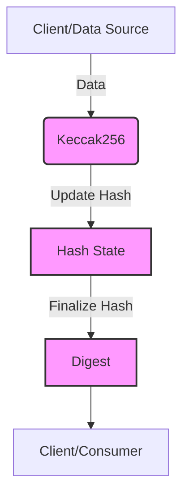

## Module: Keccak256.java
模块名称：Keccak256.java

**主要目标**：Keccak256模块的主要目的是提供一个实现Keccak-256哈希算法的工具，这是一种加密哈希函数，广泛应用于区块链技术中，特别是在以太坊项目中。

**关键功能**：
- `public Keccak256()`：构造函数，初始化Keccak-256哈希引擎。
- `public Digest copy()`：复制当前哈希状态到一个新的实例。
- `protected byte[] engineDigest()`：完成哈希计算并返回最终的哈希值。
- `protected void engineUpdate(byte arg0)` 和 `protected void engineUpdate(byte[] arg0, int arg1, int arg2)`：用于更新哈希计算的数据。

**关键变量**：
- 继承自`KeccakCore`的变量和方法，尽管在这个摘要中没有直接列出，但它们对于哈希计算过程是必不可少的。

**相互依赖性**：
- 作为`KeccakCore`的子类，`Keccak256`依赖于其实现的核心功能和变量，与其他系统组件的交互主要通过这些继承的功能来实现。

**核心与辅助操作**：
- 核心操作包括哈希的初始化、数据更新和最终的哈希值计算。
- 辅助操作可能包括状态的复制，这有助于在不同的哈希计算之间保持独立性。

**操作序列**：
- 通常，操作序列开始于通过构造函数初始化哈希引擎，随后通过`engineUpdate`方法更新数据，最终通过`engineDigest`方法完成哈希计算并输出结果。

**性能方面**：
- 性能考虑可能包括哈希计算的速度和效率，以及算法对内存的使用。Keccak-256旨在提供高安全性同时保持合理的性能。

**可重用性**：
- 通过提供标准的接口和继承自`KeccakCore`的灵活架构，`Keccak256`模块易于在需要Keccak-256哈希功能的其他项目中重用。

**使用**：
- 在区块链和加密货币项目中，特别是与以太坊相关的项目中，用于生成数据的加密哈希值，例如交易哈希、区块哈希等。

**假设**：
- 假设用户熟悉Keccak-256哈希算法及其在区块链技术中的应用。
- 还假设在使用之前已经正确初始化了哈希引擎，并且提供的数据符合预期格式。
## Flow Diagram [via mermaid]

