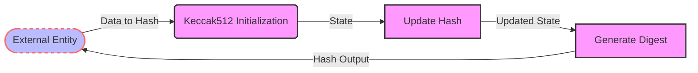

## Module: Keccak512.java
模块名称：Keccak512.java

**主要目标**：此模块的目的是实现Keccak-512哈希算法，这是一种加密哈希函数，用于各种安全应用和协议，主要在以太坊区块链项目中使用。

**关键功能**：
- `Keccak512()`：构造函数，创建哈希算法实例。
- `copy()`：复制当前哈希状态，用于创建算法的副本。
- `engineGetDigestLength()`：返回哈希输出的长度，对于Keccak-512来说是64字节。
- `engineDigest()`：完成哈希计算并返回最终的哈希值。在这个模块中，这个方法的具体实现未给出。
- `engineUpdate(byte input)`和`engineUpdate(byte[] input, int offset, int len)`：用于更新哈希计算的数据。

**关键变量**：由于代码示例中未详细展示变量，但通常关键变量包括哈希状态、缓冲区以及与哈希计算相关的任何参数。

**相互依赖性**：这个类继承自`KeccakCore`，表明它依赖于`KeccakCore`类中定义的方法和属性来实现Keccak-512算法的核心功能。

**核心与辅助操作**：核心操作包括哈希状态的初始化、更新和最终的哈希值计算。辅助操作可能包括状态复制和获取哈希长度等。

**操作序列**：典型的使用序列是首先创建`Keccak512`实例，然后通过调用`engineUpdate`方法来提供数据，最后调用`engineDigest`来获取哈希值。

**性能方面**：性能考虑可能包括哈希计算的速度和内存使用。Keccak算法被设计为高效且安全，但具体性能会根据实现的细节和运行环境而有所不同。

**可重用性**：这个类的设计允许它被重用于多种不同的上下文中，只要需要Keccak-512哈希功能。通过继承和接口的使用，它可以很容易地集成到其他系统中。

**使用**：这个模块主要用于需要Keccak-512哈希功能的地方，如加密货币钱包地址生成、数据完整性验证等。

**假设**：该实现假设用户熟悉Keccak哈希算法的基本原理和使用方式。同时，它也假设环境已经满足了运行Java代码的基本要求。
## Flow Diagram [via mermaid]

