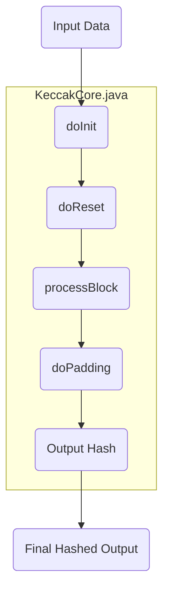

## Module: KeccakCore.java
根据提供的代码模块，以下是对该模块的综合分析：

- **模块名称**：KeccakCore.java

- **主要目标**：该模块的目的是实现Keccak哈希算法的核心功能，这是一种加密安全的哈希算法，用于生成数据的摘要或哈希值。

- **关键函数**：
  - `encodeLELong`：将64位的长整型值编码为小端序的字节数组。
  - `decodeLELong`：从小端序的字节数组解码出64位的长整型值。
  - `engineReset`：重置哈希算法的内部状态。
  - `processBlock`：处理一个数据块，执行哈希算法的主要迭代过程。
  - `doPadding`：对最后一个数据块进行填充，并完成哈希计算。
  - `doInit`：初始化哈希算法的内部状态。
  - `getBlockLength`：返回哈希算法的数据块长度。
  - `doReset`：重置算法的内部状态，准备新的哈希计算。

- **关键变量**：
  - `RC`：圆常数数组，用于每轮迭代中。
  - `A`：存储哈希状态的长整型数组。
  - `tmpOut`：临时输出缓冲区，用于存储最终的哈希值。

- **相互依赖性**：该模块作为哈希算法的核心，可能与其他用于数据输入、输出处理的模块相互作用，但在提供的代码段中未明确显示这些交互。

- **核心与辅助操作**：
  - 核心操作包括`processBlock`和`doPadding`，这些是执行哈希计算和完成哈希值生成的关键步骤。
  - 辅助操作包括`encodeLELong`和`decodeLELong`，这些方法支持数据的编码和解码。

- **操作顺序**：通常，哈希计算的流程是初始化（`doInit`），处理多个数据块（`processBlock`），最后对最后一个数据块进行填充（`doPadding`），然后输出最终的哈希值。

- **性能方面**：性能考虑可能包括算法的执行速度和内存使用。在代码注释中提到，展开四轮迭代会显著降低性能。

- **可重用性**：该模块实现了Keccak哈希算法的核心，可以被不同的上层应用重用来生成数据的哈希值。

- **使用**：该模块可以用于需要加密哈希功能的任何应用，例如加密货币（如以太坊）、数据完整性验证等。

- **假设**：
  - 输入的数据是按照小端序处理的。
  - 用户理解并正确实现了数据的填充和处理逻辑，以符合Keccak算法的规范要求。
## Flow Diagram [via mermaid]

