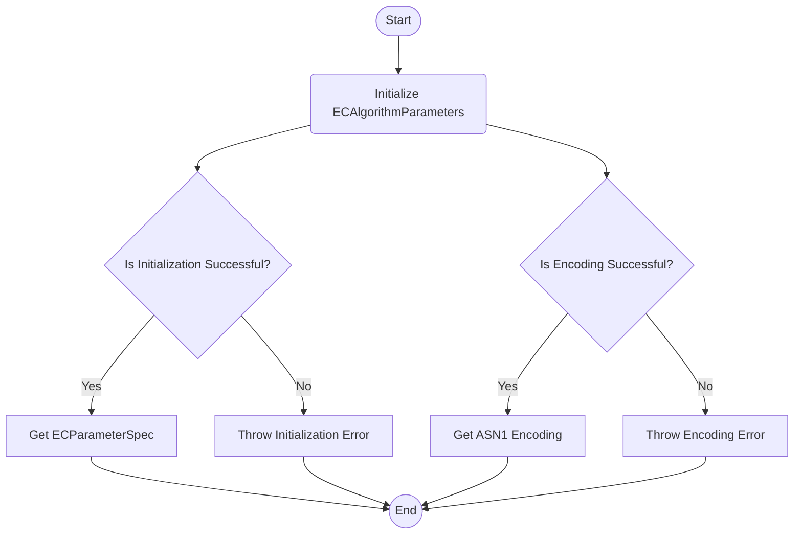

## Module: ECAlgorithmParameters.java
- **模块名称**: ECAlgorithmParameters.java

- **主要目标**: 该模块的目的是为基于椭圆曲线的加密算法提供参数配置，特别是为了支持secp256k1曲线，这是在以太坊等区块链技术中广泛使用的一种算法。

- **关键功能**:
  - `getParameterSpec()`: 获取EC算法的参数规范，返回`ECParameterSpec`实例。
  - `getASN1Encoding()`: 获取算法参数的ASN.1编码字节数组。

- **关键变量**:
  - `ALGORITHM`: 定义使用的算法名称，即"EC"。
  - `CURVE_NAME`: 指定使用的曲线名称，即"secp256k1"。

- **相互依赖性**: 该模块依赖于Java加密架构（JCE）提供的`AlgorithmParameters`和`ECGenParameterSpec`类来初始化算法参数。

- **核心与辅助操作**:
  - 核心操作包括通过`getParameterSpec`和`getASN1Encoding`提供加密参数的功能。
  - 该模块未直接提供辅助操作，但辅助功能可能涉及处理异常和错误状态。

- **操作序列**: 
  1. 通过`getInstance`方法实例化`AlgorithmParameters`对象。
  2. 使用`secp256k1`曲线初始化`AlgorithmParameters`实例。
  3. 通过`getParameterSpec`或`getASN1Encoding`方法提供算法参数或其编码。

- **性能方面**: 性能考虑主要依赖于底层JCE提供者的实现和算法参数初始化的效率。异常处理机制（通过断言）可能会对性能有轻微影响。

- **可重用性**: 该模块通过提供静态方法和预定义的曲线参数，展现了较高的可重用性，特别是在需要secp256k1曲线参数的场景中。

- **使用方式**: 该模块可被其他需要进行椭圆曲线加密操作的Java类使用，尤其是在与以太坊相关的开发中。

- **假设**:
  - 假设JRE支持EC算法参数。
  - 假设`secp256k1`曲线是正确和有效的加密参数。
  - 假设在静态初始化块中设置的算法参数不会失败。

通过上述分析，我们可以看到ECAlgorithmParameters模块为基于特定椭圆曲线（secp256k1）的加密操作提供了必要的参数配置和编码功能，它假设了JRE的支持并且在以太坊及类似技术的开发中可能被广泛使用。
## Flow Diagram [via mermaid]

