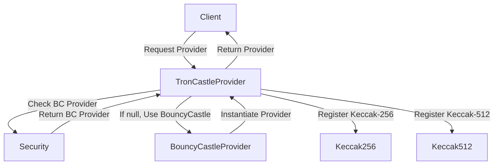

## Module: TronCastleProvider.java
- **模块名称**: TronCastleProvider.java

- **主要目标**: 该模块的目的是为了提供一个安全的加密服务提供者，特别是为了支持TRON项目中使用的Keccak-256和Keccak-512散列函数。

- **关键函数**:
  - `getInstance()`: 该方法用于获取加密服务提供者的实例。如果已经存在一个名为"BC"的提供者，则使用它；否则，创建并使用一个新的BouncyCastleProvider实例。
  
- **关键变量**:
  - `INSTANCE`: 在Holder静态内部类中定义，用于存储加密服务提供者的实例。

- **相互依赖性**:
  - 该模块依赖于Java安全框架（通过`java.security.Provider`和`java.security.Security`）和BouncyCastle加密库（通过`org.bouncycastle.jce.provider.BouncyCastleProvider`）来实现其功能。
  - 同时，它通过将Keccak256和Keccak512散列功能注册到提供者实例中，与`org.tron.common.crypto.cryptohash.Keccak256`和`org.tron.common.crypto.cryptohash.Keccak512`类交互。

- **核心与辅助操作**:
  - 核心操作是提供加密服务提供者的实例，特别是支持TRON-KECCAK-256和TRON-KECCAK-512消息摘要算法。
  - 没有明确的辅助操作，但可以认为内部类Holder的实现是为了支持延迟加载和线程安全的单例模式。

- **操作序列**:
  - 当调用`getInstance()`方法时，首先检查是否存在名为"BC"的提供者。如果存在，则使用它；如果不存在，则创建一个新的BouncyCastleProvider实例，并注册TRON特有的Keccak散列函数。

- **性能方面**:
  - 使用单例模式和静态初始化块可以减少重复创建提供者实例的开销，从而提高性能。
  - 选择BouncyCastle作为加密提供者，因为它是一个广泛使用且性能优秀的加密库。

- **可重用性**:
  - 该模块通过提供一个通用的加密服务提供者接口（尤其是支持Keccak散列函数），具有较高的可重用性，可以轻松集成到需要这些功能的其他项目中。

- **使用**:
  - 主要用于TRON项目或任何需要使用Keccak-256和Keccak-512散列算法的应用中。

- **假设**:
  - 假设用户的环境中没有已经存在的名为"BC"的加密服务提供者，或者用户愿意使用该模块提供的BouncyCastleProvider实例。
  - 还假设用户了解如何在其项目中正确地引用和使用Java加密服务提供者。
## Flow Diagram [via mermaid]

