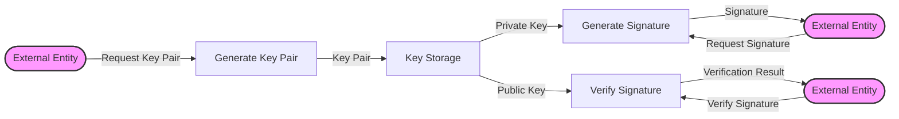

## Module: SM2.java
- **模块名称**：SM2.java

- **主要目标**：实现中国商用密码标准SM2。

- **关键功能**：
  - `SM2()`：构造函数，用于生成新的密钥对或从给定的私钥/公钥生成SM2实例。
  - `sign()`：签名方法，对给定的消息哈希进行签名。
  - `verify()`：验证方法，验证给定的签名是否有效。
  - `fromPrivate()` 和 `fromPublicOnly()`：静态方法，用于从私钥或公钥生成SM2实例。

- **关键变量**：
  - `SM2_N`, `SM2_P`, `SM2_A`, `SM2_B`, `SM2_GX`, `SM2_GY`：定义SM2曲线的参数。
  - `privKey`：私钥。
  - `pub`：公钥（ECPoint类型）。

- **相互依赖性**：
  - 与Bouncy Castle库紧密集成，用于密钥生成、签名和验证等加密操作。
  - 依赖`ECKey`、`SM2Signature`等类及其方法来处理具体的加密任务。

- **核心与辅助操作**：
  - 核心操作包括密钥生成、签名和验证。
  - 辅助操作包括密钥和签名的序列化和反序列化、地址计算等。

- **操作序列**：
  - 通常首先生成或提供密钥（私钥和公钥），然后使用这些密钥进行签名或验证操作。

- **性能方面**：
  - 性能考虑主要集中在加密操作的效率和安全性上，例如，使用安全的随机数生成器和优化的数学运算。

- **可重用性**：
  - 该模块设计为可重用，可以在需要SM2加密功能的任何地方使用。

- **使用**：
  - 用于需要SM2签名和验证的场景，如数字货币交易、安全通信等。

- **假设**：
  - 假设使用者熟悉SM2加密标准和基本的加密概念。
  - 假设底层的加密库（如Bouncy Castle）是安全且可靠的。
## Flow Diagram [via mermaid]

