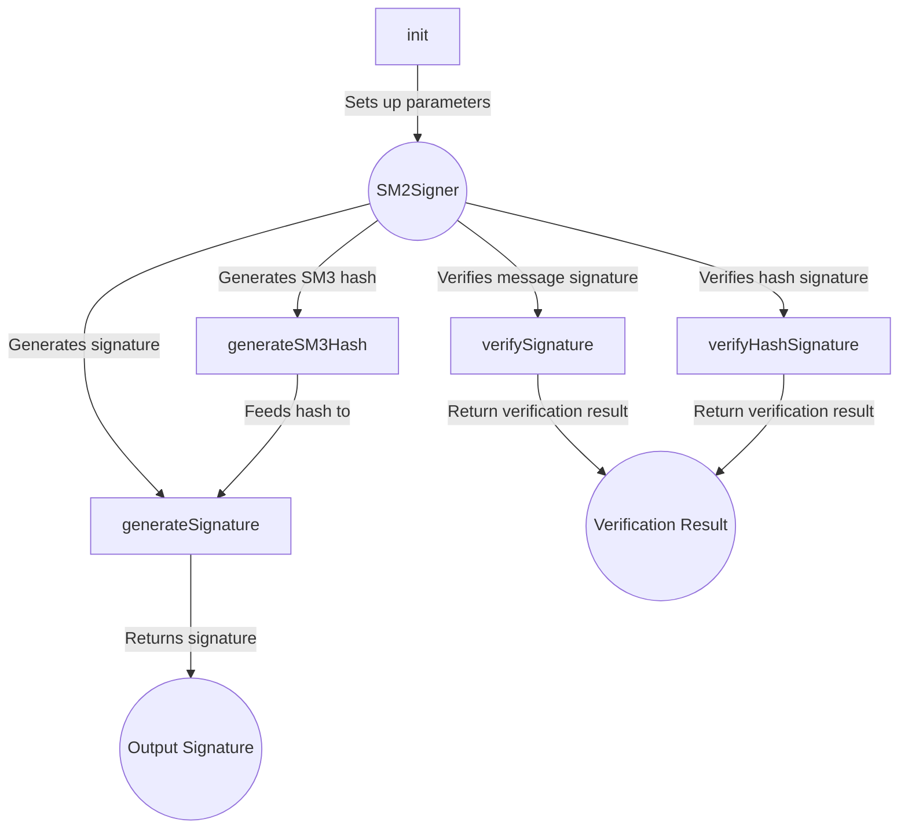

## Module: SM2Signer.java
- **模块名称**：SM2Signer.java
- **主要目标**：SM2Signer类的目的是提供SM2数字签名的生成和验证功能。SM2是一种公钥加密标准，主要用于数字签名、密钥交换等。
- **关键功能**：
  - `init`：初始化签名或验证操作，配置必要的参数。
  - `generateSignature`：生成给定消息的数字签名。
  - `generateSM3Hash`：利用SM3摘要算法生成消息的哈希值。
  - `generateHashSignature`：根据给定的哈希值生成签名。
  - `verifySignature`：验证给定消息的签名。
  - `verifyHashSignature`：根据哈希值验证签名。
- **关键变量**：
  - `userID`：用户标识符。
  - `curveLength`：曲线长度。
  - `ecParams`：椭圆曲线域参数。
  - `pubPoint`：公钥点。
  - `ecKey`：椭圆曲线密钥参数。
  - `random`：安全随机数生成器。
- **相互依赖性**：该模块依赖于Bouncy Castle库中的类和接口，如`ECDomainParameters`、`ECKeyParameters`等，用于执行椭圆曲线加密相关的操作。
- **核心与辅助操作**：核心操作包括签名生成和验证。辅助操作包括哈希生成和参数初始化。
- **操作序列**：首先通过`init`方法初始化参数，然后根据需求调用`generateSignature`或`verifySignature`执行签名生成或验证。
- **性能考虑**：性能因素包括安全随机数生成、哈希计算和椭圆曲线点的乘法运算。优化这些操作的效率对提升整体性能至关重要。
- **可重用性**：该模块设计为可重用，可以轻松集成到需要SM2签名功能的任何Java应用程序中。
- **使用**：在需要进行SM2数字签名生成或验证的场景中使用，如数字证书、安全通信等。
- **假设**：假设用户提供的消息和参数是有效的，并且已经正确配置了椭圆曲线参数。此外，还假设使用者有一定的密码学背景知识，能够正确地使用这些功能。
## Flow Diagram [via mermaid]

