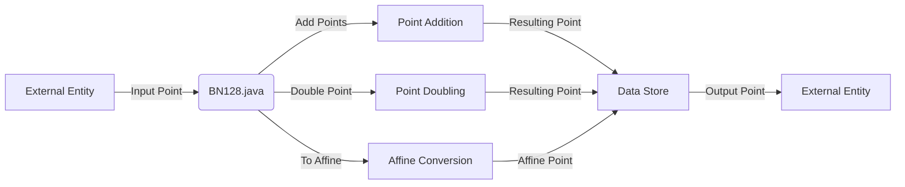

## Module: BN128.java
- **模块名称**：BN128.java

- **主要目标**：实现定义在抽象有限字段上的Barreto–Naehrig曲线，这个曲线是zkSNARKs关键之一。

- **关键函数**：
  - `zero()`：返回以以太坊表示法编码的无穷远点（0; 0; 0）。
  - `instance(T x, T y, T z)`：根据给定的x, y, z坐标创建一个BN128实例。
  - `toAffine()`：将给定的雅可比坐标转换为仿射坐标，然后创建一个点。
  - `toEthNotation()`：运行仿射变换，并将无穷远点编码为（0; 0; 0）。
  - `add(BN128<T> o)`：实现点加操作。
  - `mul(BigInteger s)`：实现点乘操作。
  - `dbl()`：实现点的加倍操作。
  - `isZero()`：检查当前点是否为无穷远点。
  - `isValid()`：验证点是否有效，即坐标是否属于字段，以及点是否在曲线上。

- **关键变量**：
  - `x, y, z`：表示点在雅可比坐标系中的坐标。

- **互相依赖性**：该模块可能与其他进行椭圆曲线密码学运算的模块相互作用，例如配对操作实现（如`PairingCheck`）。

- **核心与辅助操作**：
  - 核心操作包括点加、点乘和加倍操作，这些是椭圆曲线上的基本算术运算。
  - 辅助操作包括坐标转换（如`toAffine()`和`toEthNotation()`）和验证操作（如`isValid()`）。

- **操作序列**：在进行点加或点乘操作前，可能会先将点转换为合适的坐标系中，操作完成后可能会转换回原坐标系或以太坊特定的表示法。

- **性能方面**：性能考虑可能包括算法优化以减少计算复杂度和提高运算速度，特别是在点乘操作中。

- **可重用性**：该模块的设计允许它在不同的密码学应用中重用，尤其是那些需要使用Barreto–Naehrig曲线的zkSNARKs实现中。

- **使用**：在以太坊及其他区块链技术中，用于实现隐私保护的交易和智能合约，例如ZCash协议中的零知识证明。

- **假设**：假设使用的字段和曲线参数已经过精心选择，以确保安全性和效率。此外，假设调用者熟悉椭圆曲线密码学的基本概念和操作。
## Flow Diagram [via mermaid]

