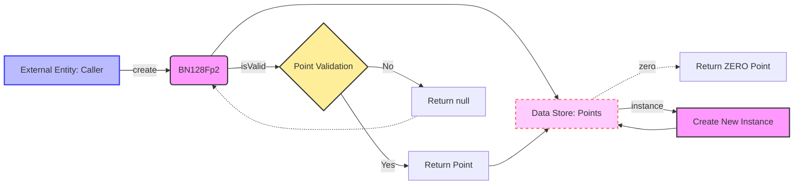

## Module: BN128Fp2.java
### BN128Fp2 模块分析

- **模块名称**: BN128Fp2.java

- **主要目标**: 该模块的目的是定义在 F_p2 上的 BN128 曲线，其中 F_p2 表示二次扩展域。这是在以太坊智能合约中实现零知识证明等加密操作的基础。

- **关键函数**:
  - `BN128Fp2(Fp2 x, Fp2 y, Fp2 z)`: 构造函数，用于创建一个点在 BN128 曲线上。
  - `BN128Fp2(BigInteger a, BigInteger b, BigInteger c, BigInteger d)`: 另一个构造函数，接受四个 `BigInteger` 参数来创建曲线上的点。
  - `create(byte[] aa, byte[] bb, byte[] cc, byte[] dd)`: 静态方法，根据提供的字节数组参数创建并验证曲线上的点。
  - `zero()`: 重写的方法，用于获取表示无穷远点的曲线点。
  - `instance(Fp2 x, Fp2 y, Fp2 z)`: 用于创建曲线上的新点。
  - `b()`: 返回曲线方程中的常数 b。
  - `one()`: 返回表示数值 1 的 Fp2 对象。

- **关键变量**:
  - `ZERO`: 表示曲线上的无穷远点。

- **相互依赖**:
  - 该模块依赖于 `Fp2` 类来表示 F_p2 上的元素，以及 `Params` 类中定义的参数，如曲线方程的常数 `B_Fp2` 和素数 `P`。

- **核心与辅助操作**:
  - 核心操作包括曲线点的创建、验证和表示。辅助操作包括曲线参数的获取和无穷远点的表示。

- **操作序列**:
  - 通常首先通过调用 `create` 方法使用字节参数创建曲线上的点，然后可以使用该点进行进一步的加密操作。

- **性能方面**:
  - 性能考量主要涉及点的验证和曲线运算的效率，这对于加密操作的速度和安全性至关重要。

- **可重用性**:
  - 该模块设计为可重用的组件，可以在不同的加密场景中应用 BN128 曲线操作。

- **使用情况**:
  - 主要用于实现以太坊智能合约中的加密操作，如零知识证明。

- **假设**:
  - 假设输入的字节参数正确表示了曲线上的点。假设调用者熟悉 BN128 曲线和相应的加密原理。

通过上述分析，可以看出 BN128Fp2 模块是以太坊加密库中的一个关键组件，提供了在特定曲线上操作点的基本功能，支持智能合约中复杂的加密操作。
## Flow Diagram [via mermaid]

