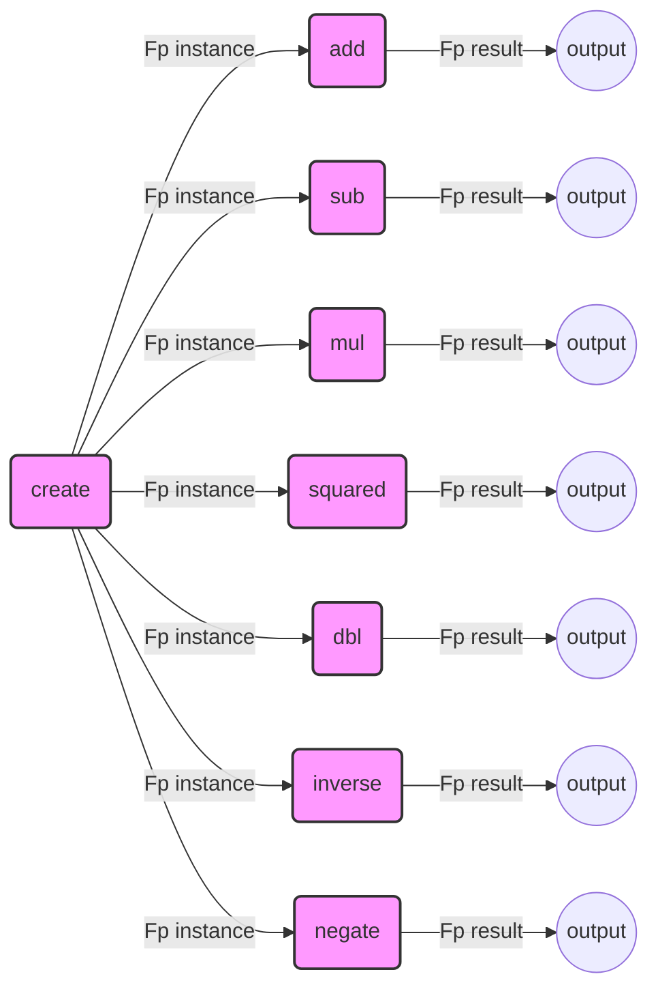

## Module: Fp.java
模块名称：Fp.java

主要目标：该模块的目的是实现F_p域上的算术运算，其中p是一个特定的质数。这在密码学和区块链技术中，尤其是在以太坊的零知识证明中，扮演着重要的角色。

关键函数：
- `add(Fp o)`: 实现两个Fp元素的加法。
- `mul(Fp o)`: 实现两个Fp元素的乘法。
- `sub(Fp o)`: 实现两个Fp元素的减法。
- `squared()`: 返回Fp元素的平方。
- `dbl()`: 返回Fp元素的加倍。
- `inverse()`: 返回Fp元素的逆元。
- `negate()`: 返回Fp元素的相反数。
- `isZero()`: 判断Fp元素是否为0。
- `isValid()`: 验证Fp元素是否有效。
- `mul(Fp2 o)`: 与Fp2元素进行乘法运算。
- `bytes()`: 返回Fp元素的字节数组表示。

关键变量：
- `ZERO`: 表示0的Fp元素。
- `_1`: 表示1的Fp元素。
- `NON_RESIDUE`: 一个非剩余元素。
- `_2_INV`: 2的逆元。
- `v`: Fp元素的值。

相互依赖性：该模块与Fp2模块有相互操作，例如在`mul(Fp2 o)`方法中与Fp2类型的对象进行乘法运算。

核心 vs. 辅助操作：核心操作包括加法、减法、乘法、平方、加倍、求逆和求相反数等算术运算。辅助操作包括验证元素有效性、比较、哈希代码和字符串表示等。

操作序列：通常，Fp元素的操作遵循标准的数学规则，如先乘除后加减，以及先进行逆或相反数运算。

性能方面：性能考虑包括如何有效地实现模运算以保证计算效率，尤其是在大数运算中。

可重用性：由于Fp模块实现了基本的数学运算，它可以被重用于任何需要在F_p域上进行算术运算的场景。

使用：在区块链技术，特别是在以太坊的智能合约和零知识证明中，需要进行F_p域上的算术运算时，会使用到这个模块。

假设：假设输入的BigInteger值是有效的，并且在进行运算时不会超出F_p域的范围。
## Flow Diagram [via mermaid]

