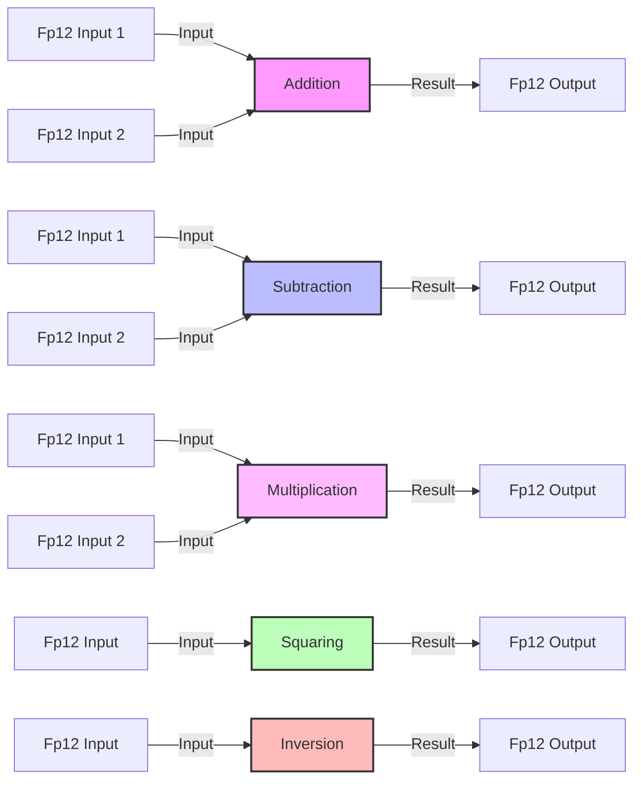

## Module: Fp12.java
**模块名称**：Fp12.java

**主要目标**：Fp12类实现了在Fp_12域上的算术运算。Fp_12是一个扩展字段，基于Fp6，用于密码学和区块链技术中，特别是在以太坊的零知识证明中。

**关键函数**：
- `squared()`：计算并返回当前Fp12元素的平方。
- `mul(Fp12 o)`：将当前Fp12元素与另一个Fp12元素相乘。
- `add(Fp12 o)`：将当前Fp12元素与另一个Fp12元素相加。
- `sub(Fp12 o)`：从当前Fp12元素中减去另一个Fp12元素。
- `inverse()`：计算并返回当前Fp12元素的逆元。
- `negate()`：返回当前Fp12元素的相反数。
- `frobeniusMap(int power)`：应用Frobenius映射于当前元素，用于计算。
- `cyclotomicSquared()`：在cyclotomic subgroup上计算元素的平方，优化了性能。
- `cyclotomicExp(BigInteger pow)`：在cyclotomic subgroup上对元素进行幂运算。
- `unitaryInverse()`：计算并返回当前Fp12元素的单位逆元。
- `negExp(BigInteger exp)`：对给定的指数进行负幂运算。

**关键变量**：
- `Fp6 a, b`：Fp12元素由两个Fp6元素组成，分别为`a`和`b`。
- `FROBENIUS_COEFFS_B`：用于Frobenius映射的系数。

**依赖性**：
- 依赖于`Fp6`类和`Fp2`类进行底层的运算。

**核心 vs. 辅助操作**：
- 核心操作包括加法、乘法、平方、逆元等基本的域运算。
- 辅助操作包括`toString`、`equals`、`hashCode`等，用于提高开发和调试的便利性。

**操作序列**：
1. 创建Fp12实例。
2. 对实例执行算术运算（如加、乘、平方等）。
3. 使用Frobenius映射和cyclotomic方法优化特定运算。

**性能方面**：
- 特别针对Fp12上的运算进行了优化，如`cyclotomicSquared`和`cyclotomicExp`方法，以提高算法在密码学应用中的效率。

**可重用性**：
- 该模块设计为可重用，可以在需要进行Fp12域运算的任何地方使用。

**使用**：
- 在以太坊和类似的区块链技术中，用于实现零知识证明等高级加密技术。

**假设**：
- 假设输入的Fp6元素是有效的，并且所有运算都在预定的素数域上进行。

通过这个分析，我们可以看到Fp12.java模块是在密码学和区块链技术中进行高效和安全运算的关键组件，特别是在实现零知识证明和其他高级协议中。
## Flow Diagram [via mermaid]

